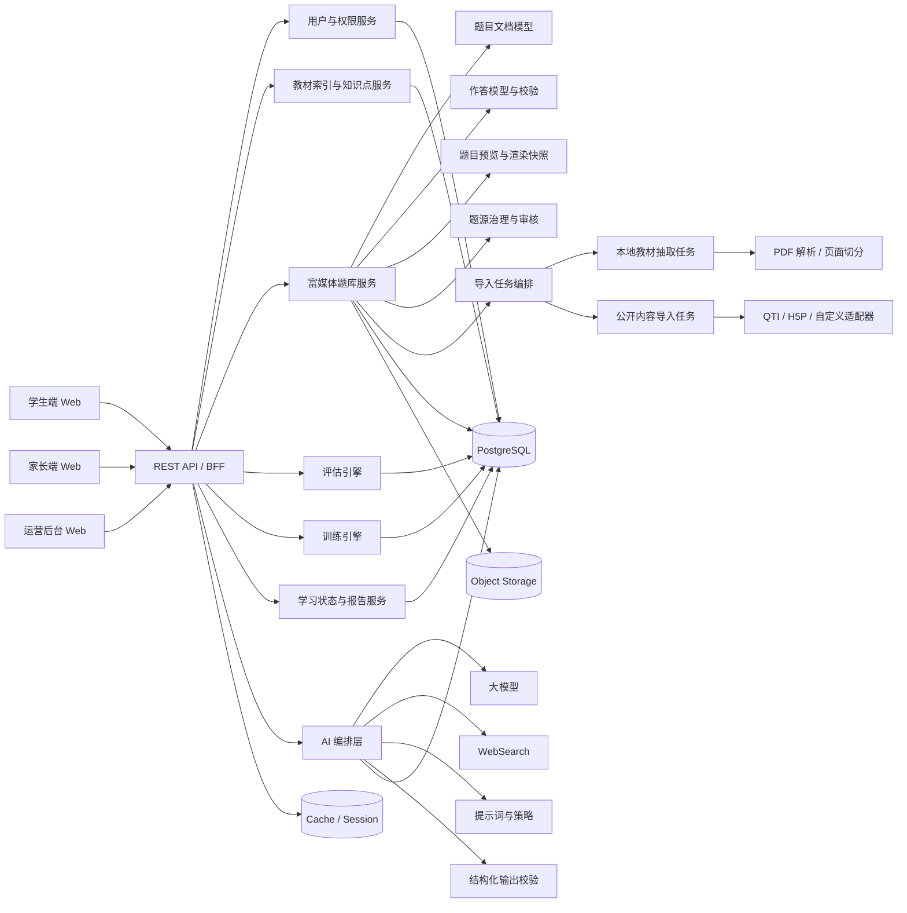
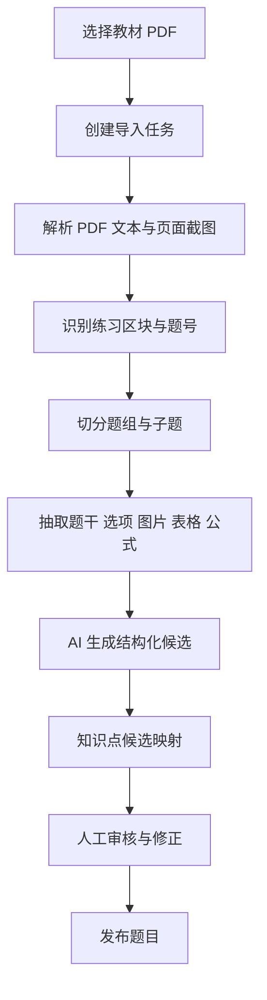
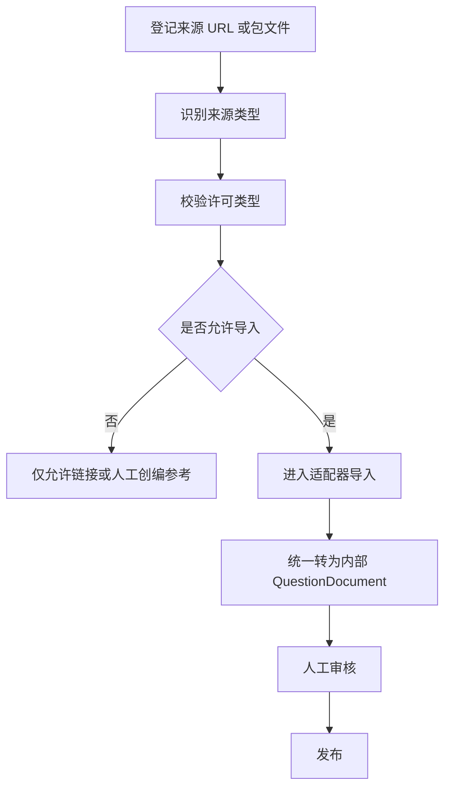

# 小学学习闭环系统 Web 详细设计

## 1. 设计目标

本设计面向小学升学相关核心学科的 Web 学习系统，目标是把教材索引、知识点模型、富媒体题库、评估训练机制、AI 分析能力和悬浮助教交互整合成一套可逐步实施的技术方案。

本轮设计重点补齐以下短板：

1. 题目不再以单一字符串保存，而是升级为结构化题目文档。
2. 作答不再局限于文本输入，而是支持公式、图文、多子题和专业作业软件级交互。
3. 题库不再只靠手工录入，而是支持本地教材题目结构化导入和公开内容的合规接入。

---

## 2. 系统范围

### 2.1 支持学科

首期架构支持以下学科：

1. 语文
2. 数学
3. 英语

### 2.2 首轮业务重点

首轮业务实现仍以数学闭环优先，但下列基础能力必须一次设计到位：

1. 三科统一教材与知识点模型。
2. 富媒体题目统一内容模型。
3. 多题型统一作答与判题接入模型。
4. 题源、许可和审核统一治理。

### 2.3 支持角色

1. 学生
2. 家长
3. 教研与内容运营
4. 教师或辅导者
5. 管理员

---

## 3. 总体架构

建议采用“Web 前端 + API 服务层 + 题目内容引擎 + AI 编排层 + 数据层 + 异步导入任务层”的结构。



---

## 4. 前端设计

### 4.1 学生端

学生端不再是普通表单答题页，而是“学习工作区”。

核心页面：

1. 学生首页
2. 评估工作区
3. 训练工作区
4. 结果与复盘页
5. 悬浮助教面板

### 4.2 家长端

家长端重点承载：

1. 学生档案与教材配置
2. 今日任务理解
3. 评估结果与周报查看
4. 悬浮助教问答

### 4.3 运营后台

运营后台新增以下工作台：

1. 教材与知识点工作台
2. 富媒体题目编辑器
3. 导入任务工作台
4. 题源与许可工作台
5. 审核与发布工作台

### 4.4 前端核心组件

建议形成统一题目工作区组件体系：

```ts
type QuestionRenderer;
type QuestionBlockRenderer;
type FormulaField;
type RichTextStem;
type TableAnswerGrid;
type ImageAnswerUploader;
type GeometryCanvas;
type MultiPartQuestionPanel;
type ReadingAndQuestionLayout;
type QuestionToolbar;
type AnswerDraftStore;
type AssistantDock;
```

### 4.5 关键前端能力

1. 公式输入与虚拟键盘。
2. 图片、表格、子题组与材料题联动渲染。
3. 自动保存草稿与断点恢复。
4. 低年级简化模式与高年级完整模式切换。
5. 作答页内嵌悬浮助教上下文感知。

---

## 5. 富媒体题目内容模型

### 5.1 核心原则

系统内部统一采用“题目文档 + 作答模式 + 判题配置”的三层模型，而不是把题目、答案、解析都压成字符串字段。

### 5.2 题目文档结构

建议定义 `QuestionDocument`：

```ts
type QuestionDocument = {
  version: string;
  locale: 'zh-CN';
  blocks: QuestionBlock[];
  attachments: QuestionAttachment[];
  layout: QuestionLayoutConfig;
  accessibility: AccessibilityConfig;
};

type QuestionBlock =
  | TextBlock
  | MathBlock
  | ImageBlock
  | TableBlock
  | AudioBlock
  | VideoBlock
  | ReadingBlock
  | SubQuestionGroupBlock
  | GeometryCanvasBlock
  | DividerBlock;
```

### 5.3 作答模型

建议定义 `AnswerSchema`：

```ts
type AnswerSchema = {
  mode:
    | 'single_choice'
    | 'multiple_choice'
    | 'boolean'
    | 'text_blank'
    | 'numeric_blank'
    | 'formula_blank'
    | 'multi_blank'
    | 'table_fill'
    | 'matching'
    | 'sorting'
    | 'drag_drop'
    | 'hotspot'
    | 'geometry_draw'
    | 'stepwise'
    | 'image_upload'
    | 'short_answer'
    | 'audio_record';
  responseShape: Record<string, unknown>;
  validationRules: Record<string, unknown>;
  gradingConfig: Record<string, unknown>;
};
```

### 5.4 判题分层

1. 纯客观题由规则判题器处理。
2. 半结构化题由规则判题与 AI 分析联合处理。
3. 主观题、过程题、图像题、语音题由 AI 分析与人工复核策略联合处理。

---

## 6. 题库建设与导入架构

### 6.1 本地教材导入管线

本地教材导入不是简单把 PDF 入库，而是一个“解析 -> 切分 -> 结构化 -> 审核 -> 发布”的任务链。



### 6.2 公开内容导入管线

公开内容接入必须先通过题源治理层。



### 6.3 导入适配层

建议导入层支持以下适配器：

1. `TextbookPdfImportAdapter`
2. `QtiImportAdapter`
3. `H5PImportAdapter`
4. `ManualQuestionSeedAdapter`

说明如下：

1. `QTI` 用于题目和测试内容的标准化交换。
2. `H5P` 适合引入部分开放的互动内容形态。
3. 本地教材 PDF 适合作为当前最核心内容来源。
4. 公开平台资源若无明确再分发许可，不进入导入适配器，只保留链接型引用。

---

## 7. 题源治理设计

### 7.1 题源分级

建议建立 `SourceLicenseClass`：

1. `A_INTERNAL`
2. `B_OPEN`
3. `C_PUBLIC_REFERENCE_ONLY`
4. `D_COMMERCIAL_PARTNER`

### 7.2 必备字段

每道题都必须有：

1. `sourceType`
2. `sourceName`
3. `sourcePathOrUrl`
4. `licenseClass`
5. `licenseName`
6. `importJobId`
7. `reviewStatus`
8. `publishedAt`

### 7.3 控制规则

1. 没有题源记录的题目不得发布。
2. 许可分类未确认的题目不得进入学生端。
3. `C_PUBLIC_REFERENCE_ONLY` 内容不得以完整题面形式直接重建入库。
4. 导入任务的自动结果必须经过人工审核。

---

## 8. AI 编排层在题库中的职责

AI 编排层不直接拥有题目数据，但要为题库与作答提供以下能力：

1. 题目切分和结构化建议。
2. 公式与表格块识别。
3. 知识点候选推荐。
4. 导入异常解释。
5. 主观题和过程题分析。
6. 作答提示与复盘生成。

同时必须满足以下约束：

1. AI 输出必须过结构化 schema 校验。
2. AI 无法确认来源和许可时，只能返回错误，不得臆造。
3. 题目解析类 AI 结果默认进入人工审核。

---

## 9. 后端模块划分

### 9.1 用户与权限服务

负责账号、学生档案、家长绑定和角色权限。

### 9.2 教材索引与知识点服务

负责教材册次、章节树、知识点树和教材映射。

### 9.3 富媒体题库服务

负责题目文档、作答模式、题源治理、审核发布和导入任务。

### 9.4 评估引擎

负责组卷、会话、答题记录、判题和评估结果。

### 9.5 训练引擎

负责任务生成、训练会话、提示恢复和反馈触发。

### 9.6 AI 编排层

负责模型调用、上下文组装、WebSearch、结构化输出校验和助教会话。

### 9.7 学习状态与报告服务

负责掌握度投影、报告生成、风险识别和家长建议。

---

## 10. 数据模型建议

### 10.1 题库主表

1. `questions`
2. `question_documents`
3. `question_blocks`
4. `question_attachments`
5. `question_sources`
6. `question_answer_schemas`
7. `question_render_snapshots`
8. `question_review_tasks`
9. `question_import_jobs`
10. `question_import_records`

### 10.2 关键关系

1. `questions` 保存题目基础元数据、学科、难度、状态。
2. `question_documents` 保存题目结构化文档版本。
3. `question_answer_schemas` 保存作答结构与判题配置。
4. `question_sources` 保存来源、许可和导入信息。
5. `question_import_records` 保存导入过程中的页面切片、原文、候选结构与审核结果。

---

## 11. 核心接口

### 11.1 运营接口

1. `POST /api/admin/question-import-jobs`
2. `GET /api/admin/question-import-jobs/:jobId`
3. `POST /api/admin/questions`
4. `PATCH /api/admin/questions/:id`
5. `POST /api/admin/questions/:id/document`
6. `POST /api/admin/questions/:id/answer-schema`
7. `POST /api/admin/questions/:id/source`
8. `POST /api/admin/questions/:id/knowledge-points`
9. `POST /api/admin/questions/:id/preview`
10. `PATCH /api/admin/questions/:id/publish`

### 11.2 评估与训练运行时接口

1. `GET /api/questions/:id/render`
2. `POST /api/questions/:id/answers/validate`
3. `POST /api/assessments/:sessionId/answers`
4. `POST /api/missions/:missionId/answers`
5. `POST /api/missions/:missionId/hints`

---

## 12. 前后端交互规范

### 12.1 题目渲染

后端返回统一 `QuestionRenderPayload`，前端根据块类型和作答模式选择组件渲染。

### 12.2 作答提交

前端提交统一 `StudentAnswerPayload`，后端先做 schema 校验，再进入规则判题或 AI 分析。

### 12.3 恢复机制

每次题目交互需要持久化草稿，支持：

1. 页面刷新恢复
2. 设备短时断线恢复
3. 题组跨题切换恢复

---

## 13. 开发顺序建议

### 13.1 第一批

1. 题目文档模型与数据库结构
2. 数学公式输入与渲染
3. 图文题与子题组渲染
4. 题目后台编辑器基础版
5. 本地教材导入任务骨架

### 13.2 第二批

1. 表格题、图片题、分步题作答
2. 评估与训练对新题型的消费
3. 导入审核工作台
4. 题源治理工作台

### 13.3 第三批

1. QTI 与 H5P 适配器
2. 英语音频题与语文阅读题支持
3. 几何画布和更复杂交互

---

## 14. 首轮验收标准

当以下条件满足时，可认为富媒体题库与专业作答能力已具备首轮可用性：

1. 数学题可用结构化文档保存与渲染。
2. 学生可完成公式、图文、子题组和图片上传等真实作答。
3. 本地教材题目可通过导入任务进入审核并发布。
4. 每道题具备题源、许可和审核信息。
5. 评估与训练模块可以消费同一套题目渲染与作答协议。
6. AI 在导入、判题和助教场景中提供真实能力，失败时明确报错，不输出 mock 或伪结果。
