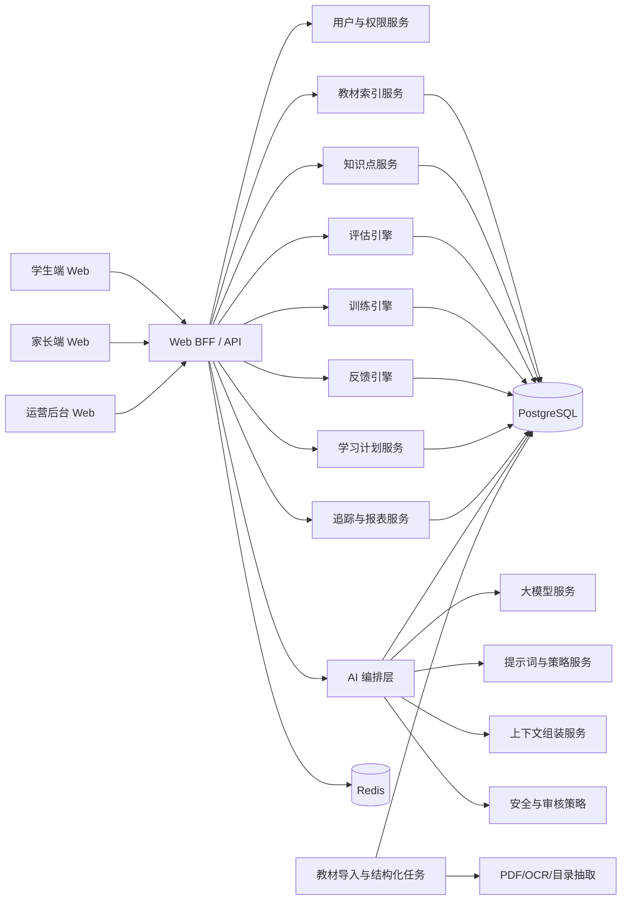
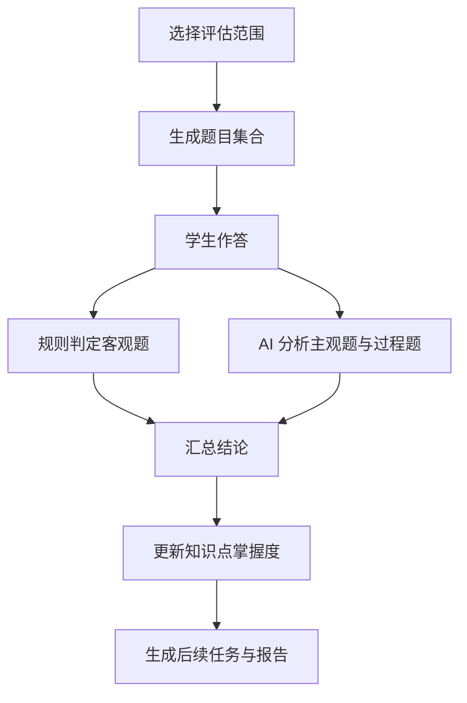
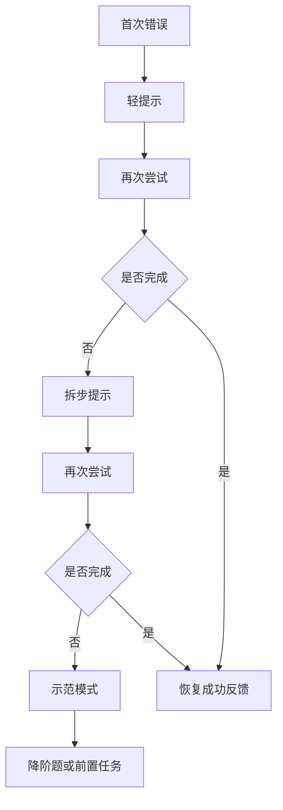

# 小学学习闭环系统 Web 详细设计

## 1. 设计目标

本设计面向小学升学相关核心学科的 Web 学习系统，目标是把教材索引、知识点模型、评估训练机制、AI 分析能力和悬浮助教交互整合成一套可实现的产品与技术方案。

系统的明确设计目标如下：

1. 仅覆盖小学升学相关核心学科
2. 以教材索引和知识点体系为底座
3. 在关键环节深度接入 AI 大模型
4. 在学生端和家长端提供统一的悬浮助教机器人
5. 让系统具备可持续闭环能力，而不是只做单点功能

---

## 2. 系统范围

### 2.1 支持学科

首期支持以下小学升学相关核心学科：

1. 语文
2. 数学
3. 英语

### 2.2 暂不支持学科

首期不接入以下暂不纳入范围的学科：

1. 体育与健康
2. 音乐
3. 美术
4. 艺术
5. 书法练习指导
6. 科学
7. 道德与法治

### 2.3 支持角色

1. 学生
2. 家长
3. 教研/内容运营
4. 教师或辅导者
5. 管理员

---

## 3. 总体架构

建议采用“Web 前端 + 业务服务层 + AI 编排层 + 数据层 + 后台任务层”的结构。

---

## 4. 技术栈建议

### 4.1 前端

1. Next.js
2. React
3. TypeScript
4. Tailwind CSS 或同类方案

### 4.2 后端

1. NestJS 或同类 TypeScript 服务框架
2. REST API 为主
3. 事件驱动机制用于任务完成、AI 分析触发和报表生成

### 4.3 数据层

1. PostgreSQL 作为主业务数据库
2. Redis 作为缓存、会话状态和任务状态存储
3. 对象存储用于教材文件、题目资源和静态附件

### 4.4 AI 能力层

1. 大模型接口适配层
2. 提示词模板与版本管理
3. 上下文检索与组装
4. 输出约束和质量审计

---

## 5. 核心模块设计

### 5.1 用户与权限模块

职责：

1. 管理学生、家长、运营、教师等角色
2. 管理家长和学生绑定关系
3. 控制不同角色的页面与数据权限
4. 记录关键操作审计日志

### 5.2 教材索引模块

职责：

1. 扫描 `E:\ChinaTextbook` 中的目标学科教材
2. 建立学科、版本、年级、上下册索引
3. 管理章节、单元和课时结构
4. 为知识点挂载提供教材定位信息

输入范围建议只扫描：

1. `小学\语文`
2. `小学\数学`
3. `小学\英语`

### 5.3 知识点服务

职责：

1. 建立知识点树
2. 维护知识点前置关系
3. 支持不同教材版本映射到统一能力标签
4. 为评估、训练和 AI 提供结构化知识上下文

### 5.4 评估引擎

职责：

1. 生成入门评估、单元评估、阶段评估和微评估
2. 对客观题进行规则判定
3. 对主观题、过程型答案进行 AI 辅助分析
4. 输出知识点掌握结论与错因
5. 更新学生掌握度

### 5.5 训练引擎

职责：

1. 生成今日任务和本周任务
2. 按难度调节推送练习
3. 管理错题重练和间隔复习
4. 调用 AI 生成解释、提示和复盘内容
5. 记录全过程行为数据

### 5.6 正反馈引擎

职责：

1. 根据规则和 AI 生成过程反馈
2. 区分学生端和家长端的反馈口径
3. 管理勋章、成长卡、进度条等轻量激励
4. 管理 AI 鼓励文案的触发条件和输出边界

### 5.7 学习计划服务

职责：

1. 生成初始学习计划
2. 每日滚动调整任务
3. 协调教材进度、薄弱点和复习窗口
4. 调用 AI 输出个性化学习建议

### 5.8 追踪与报表服务

职责：

1. 生成学习日报和周报
2. 生成知识点热力图
3. 识别风险信号
4. 输出给 AI 做自然语言解读

### 5.9 悬浮助教机器人模块

职责：

1. 作为学生端和家长端统一 AI 入口
2. 感知当前页面上下文
3. 读取当前学习状态和报告摘要
4. 接收用户自然语言提问
5. 输出面向角色的解释、提示和建议

---

## 6. AI 编排层设计

AI 编排层是本系统的重要中台能力，不建议把大模型调用散落在各业务服务里。

### 6.1 AI 编排层职责

1. 接收业务模块的 AI 请求
2. 组装上下文
3. 选择模型和提示词
4. 对输出做结构化约束
5. 写回 AI 分析结论
6. 对高风险输出做审计和降级

### 6.2 AI 典型能力

#### 6.2.1 评估分析

输入：

1. 当前题目
2. 标准答案
3. 学生答案
4. 知识点标签
5. 学生近期学习状态

输出：

1. 判定结论
2. 错误原因
3. 建议提示层级
4. 是否需要回退前置知识

#### 6.2.2 训练提示

输入：

1. 当前任务
2. 学生已尝试步骤
3. 已触发提示次数
4. 当前知识点和前置知识点

输出：

1. 轻提示
2. 拆步提示
3. 示例性提示
4. 鼓励性提示

#### 6.2.3 报告解释

输入：

1. 学习数据摘要
2. 知识点掌握变化
3. 风险标签
4. 家长端阅读场景

输出：

1. 本周进步总结
2. 当前卡点解释
3. 建议陪伴方式
4. 不建议的沟通方式

#### 6.2.4 悬浮助教对话

输入：

1. 当前页面类型
2. 当前任务或报告 ID
3. 当前用户角色
4. 学生最近学习摘要
5. 对话历史摘要

输出：

1. 页面相关解释
2. 基于上下文的回答
3. 下一步建议
4. 温和的引导语

### 6.3 上下文组装

AI 调用时至少要组装以下上下文：

1. 当前角色
2. 当前学科
3. 当前知识点
4. 当前任务或评估
5. 最近学习行为摘要
6. 最近错误摘要
7. 教材定位信息

### 6.4 输出约束

AI 输出必须满足：

1. 不直接给出完整答案，除非处于示范模式
2. 不输出羞辱、恐吓、惩罚性语言
3. 不把单次错误解释为能力定型
4. 家长建议必须以陪伴和理解为主
5. 关键分析结论应保留结构化字段，便于追踪与审核

---

## 7. 教材索引设计

### 7.1 文件扫描规则

系统扫描目录时只纳入语文、数学、英语目录。

解析字段建议包括：

1. `stage`
2. `subject`
3. `publisher_version`
4. `grade`
5. `term`
6. `source_file_path`
7. `source_file_name`
8. `file_hash`
9. `page_count`
10. `status`

### 7.2 教材结构化流程

建议采用半自动结构化流程：

1. 文件入库
2. 目录页抽取
3. 章节识别
4. 人工校对
5. 单元与课时建立
6. 知识点挂载

### 7.3 AI 在教材结构化中的作用

AI 可用于：

1. 提取目录页文本
2. 辅助识别章节层级
3. 辅助生成章节摘要
4. 辅助建议知识点候选

最终发布前仍建议保留人工校验。

---

## 8. 领域模型设计

### 8.1 核心实体

建议核心实体包括：

1. `Student`
2. `Parent`
3. `Subject`
4. `TextbookVersion`
5. `TextbookVolume`
6. `TextbookUnit`
7. `TextbookLesson`
8. `KnowledgePoint`
9. `Question`
10. `AssessmentSession`
11. `PracticeSession`
12. `PracticeItemRecord`
13. `StudentMastery`
14. `WrongQuestionRecord`
15. `StudyPlan`
16. `FeedbackEvent`
17. `AIConversationSession`
18. `AIConversationMessage`
19. `AIInsightRecord`
20. `PromptTemplate`

### 8.2 学生掌握度模型

`StudentMastery` 建议字段：

1. `student_id`
2. `knowledge_point_id`
3. `mastery_score`
4. `confidence_score`
5. `status`
6. `last_practiced_at`
7. `last_assessed_at`
8. `need_review`
9. `risk_level`

状态建议包括：

1. `unknown`
2. `learning`
3. `unstable`
4. `mastered`
5. `at_risk`

### 8.3 AI 洞察记录模型

`AIInsightRecord` 建议字段：

1. `id`
2. `student_id`
3. `subject`
4. `source_type`
5. `source_id`
6. `insight_type`
7. `summary`
8. `structured_payload`
9. `confidence_level`
10. `review_status`
11. `created_at`

### 8.4 AI 对话模型

`AIConversationSession` 建议字段：

1. `id`
2. `user_role`
3. `student_id`
4. `page_context`
5. `context_ref_type`
6. `context_ref_id`
7. `status`
8. `created_at`

`AIConversationMessage` 建议字段：

1. `session_id`
2. `sender_type`
3. `content`
4. `structured_context`
5. `created_at`

---

## 9. 评估系统详细设计

### 9.1 评估类型

1. 入门诊断评估
2. 日常微评估
3. 单元评估
4. 阶段评估
5. 错题回测

### 9.2 评估执行流程

### 9.3 AI 在评估中的职责

1. 分析开放性作答
2. 分析步骤型答案
3. 对错误进行自然语言解释
4. 识别是否属于前置知识缺失
5. 生成家长可读摘要

### 9.4 评估输出结构

每次评估至少输出：

1. 总体完成情况
2. 知识点掌握结果
3. 错误原因分类
4. 是否建议降阶
5. 推荐训练包
6. 家长解读摘要

---

## 10. 训练系统详细设计

### 10.1 任务类型

1. 新知学习任务
2. 巩固任务
3. 错题重练任务
4. 间隔复习任务
5. 单元巩固任务
6. AI 引导式微任务

### 10.2 标准任务结构

每个任务单元建议包含：

1. 任务标题
2. 目标知识点
3. 对应教材位置
4. 预计时长
5. 题目序列
6. 提示链路
7. 完成条件
8. 完成后反馈

### 10.3 难度调节

建议将题目难度抽象为 1 到 5 级。

提升条件：

1. 连续正确
2. 耗时稳定
3. 提示依赖低

降低条件：

1. 连续错误
2. 超时明显
3. 多次请求解释仍无法完成

### 10.4 AI 在训练中的职责

1. 根据学生当前卡点提供分层提示
2. 用儿童可理解语言解释知识点
3. 在任务结束后输出简短复盘
4. 在恢复场景提供鼓励和下一步建议

### 10.5 失败恢复链路

---

## 11. 正面反馈系统设计

### 11.1 反馈分类

1. 行为确认型反馈
2. 方法强化型反馈
3. 恢复鼓励型反馈
4. 阶段里程碑反馈

### 11.2 反馈触发器

建议至少支持：

1. `on_item_correct`
2. `on_retry_success`
3. `on_knowledge_progress`
4. `on_daily_mission_complete`
5. `on_weekly_goal_complete`
6. `on_recovery_after_failures`

### 11.3 AI 在反馈中的职责

AI 可做：

1. 把结构化结果翻译成自然语言鼓励
2. 根据年级和角色调整表达方式
3. 生成家长鼓励话术

AI 不应做：

1. 随意夸大结果
2. 输出笼统口号式鼓励
3. 代替规则判断进度和掌握度

---

## 12. 跟踪与报表设计

### 12.1 采集事件

1. 任务开始
2. 题目提交
3. 提示触发
4. AI 对话触发
5. 任务完成
6. 学习中断
7. 家长查看报告
8. 家长使用机器人咨询

### 12.2 指标体系

学习效果指标：

1. 知识点掌握提升率
2. 错题回正率
3. 复习保持率

学习行为指标：

1. 日任务完成率
2. 单次学习时长
3. 中断率
4. 连续学习天数

AI 交互指标：

1. 机器人使用率
2. AI 提示触发率
3. AI 建议采纳率
4. 卡点恢复率

### 12.3 报表类型

1. 学生日报
2. 家长周报
3. 单元报告
4. 阶段成长报告
5. AI 观察摘要

---

## 13. 悬浮助教机器人详细设计

### 13.1 形态设计

悬浮助教机器人建议作为全局固定组件存在于页面右下角或移动端底部浮层入口。

组件状态包括：

1. 收起态
2. 提醒态
3. 展开对话态
4. 最小化挂起态

### 13.2 学生端能力

1. 解释当前任务目标
2. 解释当前题意
3. 给轻提示、拆步提示、示范提示
4. 学习完成后做一句话复盘
5. 帮助孩子回顾今天最重要的进步

### 13.3 家长端能力

1. 解读日报和周报
2. 解释孩子卡点
3. 生成陪伴话术
4. 提供任务节奏建议
5. 回答“我现在是否需要干预”

### 13.4 上下文感知

机器人必须知道当前所处场景，例如：

1. 首页
2. 评估页
3. 任务执行页
4. 错题页
5. 周报页

上下文来源包括：

1. 页面类型
2. 当前任务 ID
3. 当前知识点
4. 当前学生阶段状态
5. 最近 AI 分析摘要

### 13.5 交互边界

机器人设计原则：

1. 优先提示，不抢主流程
2. 优先帮助理解，不代替思考
3. 优先解释结果，不制造焦虑
4. 在学生端保持简洁，在家长端保持清晰

---

## 14. Web 信息架构

### 14.1 学生端

建议页面：

1. `/student/home`
2. `/student/assessment`
3. `/student/mission/:id`
4. `/student/review`
5. `/student/growth`
6. `/student/report`

所有学生端页面均挂载悬浮助教机器人。

### 14.2 家长端

建议页面：

1. `/parent/home`
2. `/parent/report/daily`
3. `/parent/report/weekly`
4. `/parent/intervention`
5. `/parent/settings`

所有家长端页面均挂载悬浮助教机器人。

### 14.3 运营后台

建议页面：

1. `/admin/textbooks`
2. `/admin/knowledge-points`
3. `/admin/questions`
4. `/admin/feedback-templates`
5. `/admin/ai-strategies`
6. `/admin/reports`

---

## 15. API 设计建议

### 15.1 教材与知识点

1. `GET /api/textbooks`
2. `GET /api/textbooks/:id/tree`
3. `POST /api/admin/textbooks/import`
4. `GET /api/knowledge-points/:id`

### 15.2 评估与训练

1. `POST /api/assessments/start`
2. `POST /api/assessments/:id/answer`
3. `GET /api/assessments/:id/result`
4. `GET /api/missions/today`
5. `POST /api/missions/:id/answer`
6. `POST /api/missions/:id/complete`

### 15.3 AI 相关

1. `POST /api/ai/assistant/chat`
2. `POST /api/ai/assessment/analyze`
3. `POST /api/ai/feedback/generate`
4. `POST /api/ai/report/explain`
5. `GET /api/ai/session/:id/messages`

---

## 16. 安全与治理设计

### 16.1 儿童数据保护

1. 学生数据最小化存储
2. 家长权限严格绑定
3. 敏感数据访问全量留痕

### 16.2 AI 输出治理

1. 高风险场景使用结构化输出
2. 对 AI 输出做规则过滤
3. 对评估和报告结论保留可追溯来源
4. 抽样质检 AI 输出质量

### 16.3 产品边界控制

1. 不鼓励超长时长连续学习
2. 不使用强刺激成瘾机制
3. 不输出惩罚式教育建议

---

## 17. 实施路线

### 17.1 第一阶段

1. 完成教材索引导入
2. 完成知识点树基础结构
3. 完成学生和家长端基础框架
4. 完成悬浮助教机器人基础壳体

### 17.2 第二阶段

1. 上线入门评估
2. 上线今日任务
3. 上线规则驱动反馈
4. 接入 AI 评估分析和 AI 助教对话

### 17.3 第三阶段

1. 上线错题回练和间隔复习
2. 上线周报和 AI 报告解读
3. 上线风险识别和家长干预建议

### 17.4 第四阶段

1. 在当前范围稳定后，再评估是否扩展学科范围
2. 扩展拍照、语音和口语能力
3. 强化 AI 编排和策略管理能力

---

## 18. 首期验收标准

系统首期可用的验收标准建议如下：

1. 家长能完成学生建档和教材选择
2. 系统能导入语文、数学、英语教材索引
3. 学生能完成一次入门评估
4. 系统能生成今日任务和错题回练任务
5. AI 能辅助分析主观题或过程题
6. 学生端悬浮助教机器人可在任务页提供提示和复盘
7. 家长端悬浮助教机器人可解读周报并生成陪伴建议

---

## 19. 设计结论

这套 Web 方案的核心不是“在学习系统里塞一个聊天入口”，而是让 AI 成为评估、训练、反馈、报告和陪伴全过程的能力层。

因此系统的真正结构是：

1. 教材索引层负责提供稳定内容骨架
2. 知识点与掌握度层负责定义学习状态
3. 评估与训练层负责推进学习闭环
4. AI 编排层负责理解、解释、辅助和陪伴
5. 悬浮助教机器人负责把 AI 能力以统一交互入口暴露给学生和家长

只要这五层协同跑通，系统就不仅能“给题和打分”，还能真正成为一个持续运转的 AI 学习平台。
