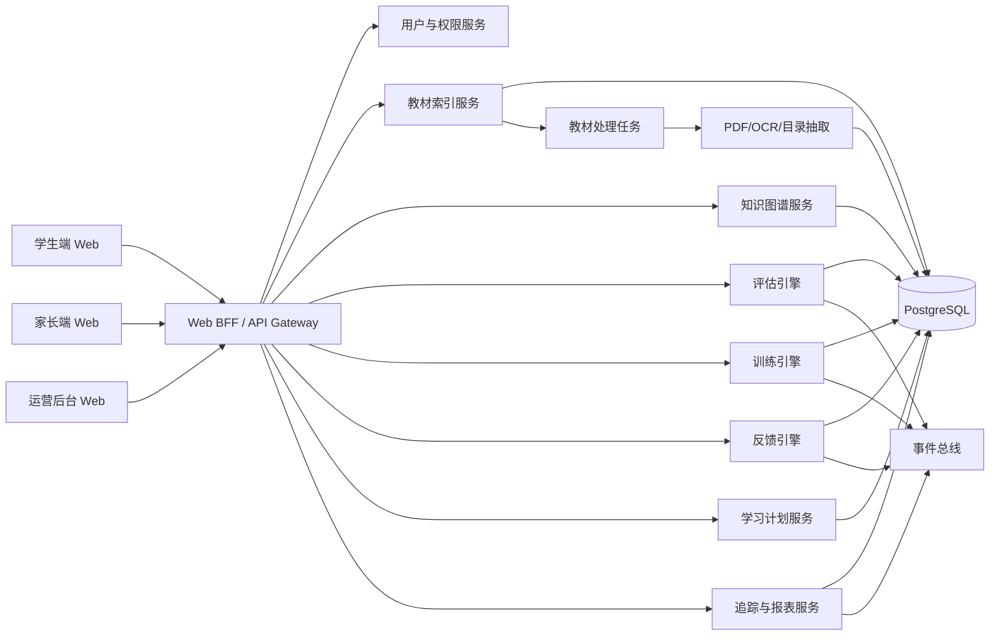
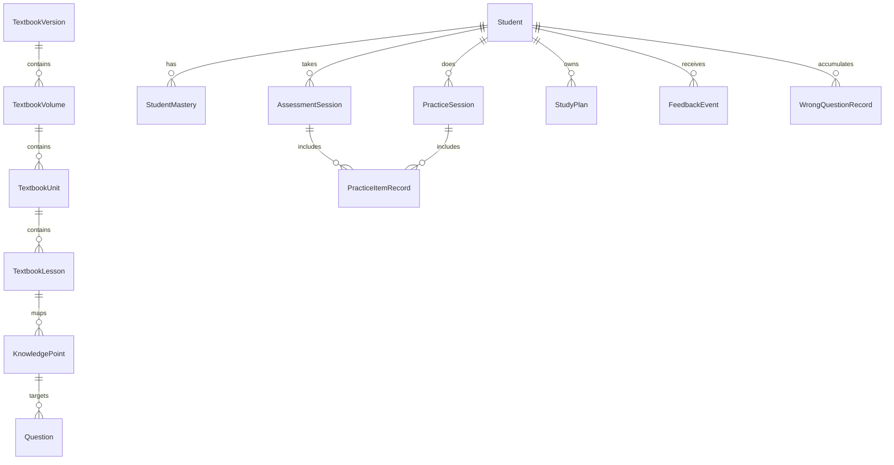
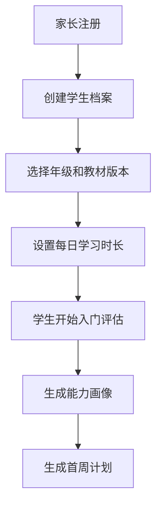
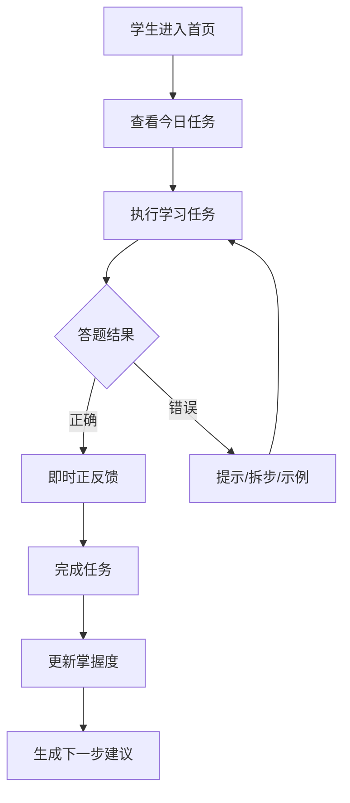

# 小学学习闭环系统 Web 详细设计

## 1. 设计目标

本设计用于承接《小学学习闭环系统需求分析》，把产品需求转化为可实现的 Web 系统蓝图。

设计目标如下：

1. 以教材索引为内容骨架
2. 以知识点掌握度为核心状态
3. 以评估、训练、反馈、跟踪为主流程
4. 以学生端为核心体验，家长端和运营端形成协同
5. 采用可扩展架构，支持后续扩科、扩版本、扩学段

---

## 2. 设计原则

### 2.1 目标前置

学生打开页面后，首先看到的是“此刻该做什么”，不是一堆统计数据。

### 2.2 反馈前移

反馈必须尽量靠近行为发生时刻，不能只停留在学习结束后。

### 2.3 难度自适应

系统优先保证题目落在有效训练区，而不是机械顺序出题。

### 2.4 失败可恢复

错误后进入提示、拆步、示例、重试链路，不直接让用户掉出流程。

### 2.5 内容可治理

教材、章节、知识点、题目、反馈模板必须可运营维护。

---

## 3. 总体架构

建议采用“Web 前端 + 业务 API + 内容处理任务 + 数据分析”的模块化单体优先架构。

### 3.1 推荐技术栈

#### 前端

1. Next.js
2. TypeScript
3. React
4. Tailwind CSS 或同类组件样式方案

#### 后端

1. NestJS 或同级 TypeScript 服务框架
2. REST API 为主，局部可增加服务内部事件机制

#### 数据层

1. PostgreSQL 作为主业务库
2. Redis 作为缓存与任务状态存储
3. 对象存储或文件存储用于教材文件与静态资源

#### 内容处理

1. Python 工具链用于 PDF 元数据抽取、OCR、目录解析
2. 后台任务系统用于教材入库和报告生成

### 3.2 逻辑架构图

---

## 4. 模块设计

### 4.1 用户与权限模块

角色定义：

1. 学生
2. 家长
3. 教师/辅导者
4. 教研/内容运营
5. 管理员

核心能力：

1. 登录与身份绑定
2. 家长与学生关系绑定
3. 多角色权限控制
4. 操作审计

### 4.2 教材索引模块

职责：

1. 扫描教材目录
2. 管理学段、学科、版本、册次
3. 维护教材文件元数据
4. 管理单元、章节、课时结构

输入来源：

1. `E:\ChinaTextbook\小学\...`
2. 人工后台维护
3. 半自动目录抽取结果

输出给其他模块的数据：

1. 当前学生使用的教材版本
2. 教材章节树
3. 对应知识点的挂载位置

### 4.3 知识图谱模块

职责：

1. 维护知识点树
2. 维护前置依赖关系
3. 支持多版本教材映射到统一能力标签
4. 为评估与训练提供命题单元

核心结构建议：

1. 教材节点：册次、单元、课时
2. 知识点节点：概念、技能、应用
3. 能力标签：计算、阅读理解、拼写、表达等
4. 依赖关系：前置、并列、拓展

### 4.4 评估引擎

职责：

1. 组卷
2. 自适应出题
3. 结果判定
4. 掌握度更新
5. 输出薄弱点与建议

评估类型：

1. 入门诊断
2. 单元测
3. 微测
4. 错题回测
5. 阶段测评

### 4.5 训练引擎

职责：

1. 生成今日任务
2. 执行知识点闯关
3. 调整题目难度
4. 安排错题与复习任务
5. 记录过程数据

训练单元建议统一抽象为 `Learning Mission`。

一个任务单元包含：

1. 目标知识点
2. 难度层级
3. 预计时长
4. 题目集合
5. 提示链路
6. 完成判定
7. 完成后反馈模板

### 4.6 正反馈引擎

职责：

1. 根据触发条件生成正向反馈
2. 控制反馈语气和粒度
3. 管理勋章、成长树、进度卡等轻量激励
4. 向家长端输出鼓励建议

其核心不是奖励发放，而是“行为确认 + 成长解释 + 下一步鼓励”。

### 4.7 学习计划服务

职责：

1. 生成初始学习计划
2. 每天滚动更新任务
3. 根据掌握度和时间预算调整计划
4. 安排复习窗口和回测节点

### 4.8 追踪与报表服务

职责：

1. 生成学生实时学习面板
2. 生成家长日报和周报
3. 输出知识点热力图
4. 识别风险信号
5. 支持运营和教研分析

---

## 5. 教材索引设计

### 5.1 文件扫描规则

从 `E:\ChinaTextbook` 扫描时，先只处理小学目录：

1. 学段目录：`小学`
2. 学科目录：如 `数学`、`语文`、`英语`
3. 版本目录：如 `人教版`、`统编版`
4. 文件名：识别年级与上下册

#### 5.1.1 建议解析字段

1. `stage`
2. `subject`
3. `publisher_version`
4. `grade`
5. `term`
6. `source_file_path`
7. `source_file_name`
8. `file_hash`
9. `file_size`
10. `page_count`

#### 5.1.2 示例

路径：

`E:\ChinaTextbook\小学\数学\人教版\义务教育教科书 · 数学三年级上册.pdf`

解析结果：

1. `stage = primary`
2. `subject = math`
3. `publisher_version = 人教版`
4. `grade = 3`
5. `term = 上册`
6. `display_name = 数学三年级上册`

### 5.2 教材结构化流程

教材 PDF 只有文件级结构，不足以直接支持学习任务，因此需要一个二次结构化流程：

1. 文件入库
2. 元数据抽取
3. 目录抽取
4. 单元与课时校对
5. 知识点挂载
6. 题目与讲解资源挂载

#### 5.2.1 结构化优先级

首期建议采用半自动方式：

1. 程序抽取目录页
2. 运营后台人工确认
3. 教研挂知识点

这样可以避免过早依赖不稳定的全自动解析。

---

## 6. 领域模型设计

### 6.1 核心实体

建议主业务实体如下：

1. `Student`
2. `Parent`
3. `Subject`
4. `TextbookVersion`
5. `TextbookVolume`
6. `TextbookUnit`
7. `TextbookLesson`
8. `KnowledgePoint`
9. `KnowledgeDependency`
10. `Question`
11. `QuestionSet`
12. `AssessmentSession`
13. `PracticeSession`
14. `PracticeItemRecord`
15. `StudentMastery`
16. `WrongQuestionRecord`
17. `StudyPlan`
18. `FeedbackEvent`
19. `RewardBadge`
20. `WeeklyReport`

### 6.2 关系概览

### 6.3 掌握度模型

建议首期使用规则型掌握度模型，避免一开始过度复杂。

`StudentMastery` 字段建议包括：

1. `student_id`
2. `knowledge_point_id`
3. `mastery_score`，范围 0-100
4. `confidence_score`
5. `last_practiced_at`
6. `last_assessed_at`
7. `wrong_streak`
8. `right_streak`
9. `need_review`
10. `status`

#### 6.3.1 状态分层建议

1. `unknown`：未接触
2. `learning`：正在学习
3. `unstable`：做对过但不稳定
4. `mastered`：稳定掌握
5. `at_risk`：出现遗忘或持续错误

---

## 7. 评估系统详细设计

### 7.1 评估流程

统一评估流程：

1. 选择评估范围
2. 生成题目集合
3. 按答题情况动态调节难度
4. 记录每题过程数据
5. 更新掌握度
6. 生成诊断结论
7. 推送后续任务

### 7.2 自适应出题规则

首期用规则引擎实现即可：

1. 若同难度连续正确 3 题且耗时低于阈值，则提升一档
2. 若连续错误 2 题，则降低一档并提供提示型题目
3. 若知识点前置未稳固，则切换到前置知识点
4. 每次评估总题量受年级和时长约束

### 7.3 评估结果输出结构

评估结果不只输出分数，还要输出：

1. 知识点掌握热力图
2. 错误类型分布
3. 前置缺口
4. 推荐任务列表
5. 家长可理解的简明说明

### 7.4 错误类型模型

首期建议支持以下通用错因标签：

1. 概念不理解
2. 审题不清
3. 计算失误
4. 步骤缺失
5. 记忆不牢
6. 迁移失败

---

## 8. 训练系统详细设计

### 8.1 任务结构

任务生成以“短时、明确、可完成”为原则。

一个标准学习任务包含：

1. 任务标题
2. 任务目标
3. 教材映射位置
4. 预计时长
5. 任务内题目序列
6. 提示与示例
7. 完成条件
8. 结束反馈

### 8.2 任务类型

#### 8.2.1 新知任务

用于刚接触的知识点，结构应为：

1. 目标说明
2. 例题演示
3. 引导练习
4. 独立练习
5. 小结

#### 8.2.2 巩固任务

用于已学但未稳定掌握的知识点。

#### 8.2.3 错题重练任务

优先处理高频错误和近期错误。

#### 8.2.4 复习任务

按时间窗口自动触发，验证记忆保持情况。

#### 8.2.5 挑战任务

只在学生状态稳定时开放，不作为必须完成项。

### 8.3 任务推荐算法

首期采用加权打分方式即可：

`priority_score = 教材进度权重 + 薄弱度权重 + 遗忘风险权重 + 近期错误权重 + 计划权重`

建议参考权重：

1. 当前教材进度：30%
2. 薄弱知识点：30%
3. 复习需求：20%
4. 近期错误：10%
5. 家长/教师指定：10%

### 8.4 难度调节

题目难度建议抽象为 1-5 级。

#### 8.4.1 提升条件

1. 连续正确
2. 耗时稳定
3. 提示依赖低

#### 8.4.2 降低条件

1. 连续错误
2. 超时明显
3. 高度依赖提示

#### 8.4.3 保持条件

表现一般但可完成时，不急于切换难度，优先维持在有效训练区间。

### 8.5 失败恢复链路

每个任务都应定义失败恢复链路：

1. 第一次错误：给轻提示
2. 第二次错误：拆步提示
3. 第三次错误：示范题
4. 示范后重试：换同类型低阶题
5. 仍不通过：打上“需要协助”标记并退出当前高难任务

---

## 9. 正面反馈系统详细设计

### 9.1 反馈分类

#### 9.1.1 行为确认型

用于确认动作有效，例如：

1. 这一步列式是对的
2. 你已经抓住了关键词

#### 9.1.2 策略强化型

用于鼓励可迁移的方法，例如：

1. 先画图再思考，这个方法很好
2. 你有检查过程，说明你在认真修正

#### 9.1.3 恢复鼓励型

用于错误恢复场景，例如：

1. 刚才虽然没做对，但你已经找到关键一步了
2. 这次比上次更接近答案

#### 9.1.4 里程碑型

用于知识点、单元、周目标完成时刻。

### 9.2 反馈触发器

建议触发器表包含：

1. `on_item_correct`
2. `on_first_try_correct`
3. `on_retry_success`
4. `on_knowledge_mastered`
5. `on_daily_mission_complete`
6. `on_weekly_goal_complete`
7. `on_streak_reached`
8. `on_recovery_after_failures`

### 9.3 反馈模板结构

每条反馈模板可设计为：

1. `trigger_code`
2. `grade_band`
3. `subject_scope`
4. `tone`
5. `message_template`
6. `visual_effect_level`
7. `parent_visible`

### 9.4 奖励机制设计

建议用“轻奖励 + 强成长解释”模式，而不是重积分模式。

奖励层级：

1. 微反馈：答题后的即时确认
2. 进度反馈：知识点进度条、今日任务完成条
3. 成长徽章：阶段成就
4. 成长叙事：周报中的“本周你攻克了什么”

### 9.5 禁止事项

1. 不使用羞辱型文案
2. 不因一次失败触发负面身份标签
3. 不把公开排名作为主要驱动力
4. 不用高频刺激性动画制造类游戏上瘾机制

---

## 10. 跟踪与报表设计

### 10.1 事件采集

系统应采集以下关键事件：

1. 登录
2. 任务开始
3. 题目作答
4. 提示触发
5. 任务完成
6. 任务中断
7. 家长查看报告
8. 家长发送鼓励

### 10.2 指标体系

#### 10.2.1 学习效果指标

1. 知识点掌握度提升
2. 单元达标率
3. 错题回正率
4. 复习保持率

#### 10.2.2 学习行为指标

1. 日完成率
2. 平均单次时长
3. 中断率
4. 连续学习天数

#### 10.2.3 体验指标

1. 高挫败任务占比
2. 提示依赖率
3. 恢复成功率

### 10.3 报表类型

1. 学生日报
2. 家长周报
3. 单元学习报告
4. 阶段成长报告
5. 教研分析报表

### 10.4 风险识别规则

首期建议基于规则识别风险：

1. 连续 3 天未完成任务
2. 同一知识点多次回落
3. 高挫败率持续升高
4. 多次在同类题超时
5. 家长长期未查看报告

系统需对不同风险给出不同处理：

1. 调整任务量
2. 降低难度
3. 安排复习
4. 通知家长协助
5. 标记教师干预

---

## 11. Web 端信息架构

### 11.1 学生端页面

建议路由结构：

1. `/student/home`：今日任务首页
2. `/student/assessment`：评估入口与过程页
3. `/student/mission/:id`：任务执行页
4. `/student/review`：复习中心
5. `/student/growth`：成长页
6. `/student/textbook`：教材地图
7. `/student/report`：学习报告

#### 11.1.1 学生首页核心区块

1. 今日第一任务
2. 预计总时长
3. 当前学习连续天数
4. 最近成长提示
5. 可选挑战任务

### 11.2 家长端页面

1. `/parent/home`：孩子总览
2. `/parent/report/daily`
3. `/parent/report/weekly`
4. `/parent/intervention`
5. `/parent/settings`

#### 11.2.1 家长端核心内容

1. 学科进度
2. 薄弱点说明
3. 今日完成情况
4. 推荐鼓励方式
5. 是否需要陪伴介入

### 11.3 运营后台页面

1. `/admin/textbooks`
2. `/admin/knowledge-points`
3. `/admin/questions`
4. `/admin/feedback-templates`
5. `/admin/reports`
6. `/admin/users`

---

## 12. 关键交互流程

### 12.1 首次建档流程

### 12.2 日常学习流程

### 12.3 单元闭环流程

1. 学生完成某单元学习
2. 系统触发单元评估
3. 生成掌握热力图
4. 自动下发巩固包和复习包
5. 周报中展示该单元成长总结

---

## 13. API 设计建议

以下为首期核心 API 分组建议。

### 13.1 学生相关

1. `POST /api/students`
2. `GET /api/students/:id/profile`
3. `GET /api/students/:id/dashboard`
4. `GET /api/students/:id/growth`

### 13.2 教材相关

1. `GET /api/textbooks`
2. `GET /api/textbooks/:id/volumes`
3. `GET /api/volumes/:id/tree`
4. `POST /api/admin/textbooks/import`

### 13.3 评估相关

1. `POST /api/assessments/start`
2. `POST /api/assessments/:id/answer`
3. `GET /api/assessments/:id/result`

### 13.4 训练相关

1. `GET /api/missions/today`
2. `POST /api/missions/:id/start`
3. `POST /api/missions/:id/answer`
4. `POST /api/missions/:id/complete`

### 13.5 报告相关

1. `GET /api/reports/daily`
2. `GET /api/reports/weekly`
3. `GET /api/reports/unit/:unitId`

---

## 14. 数据表示例

### 14.1 `textbook_volumes`

关键字段建议：

1. `id`
2. `stage`
3. `subject`
4. `publisher_version`
5. `grade`
6. `term`
7. `source_path`
8. `file_hash`
9. `status`

### 14.2 `knowledge_points`

关键字段建议：

1. `id`
2. `subject`
3. `name`
4. `description`
5. `grade_band`
6. `difficulty_level`
7. `parent_id`
8. `status`

### 14.3 `student_mastery`

关键字段建议：

1. `student_id`
2. `knowledge_point_id`
3. `mastery_score`
4. `confidence_score`
5. `status`
6. `last_practiced_at`
7. `need_review`

### 14.4 `feedback_events`

关键字段建议：

1. `student_id`
2. `trigger_code`
3. `message`
4. `source_type`
5. `source_id`
6. `created_at`

---

## 15. 规则引擎设计建议

首期不建议直接上复杂机器学习模型，优先实现可解释的规则引擎。

规则引擎至少控制以下输出：

1. 今日任务推荐
2. 题目难度切换
3. 是否进入失败恢复流程
4. 是否触发复习
5. 是否触发家长提醒
6. 是否发放正反馈卡片

规则配置建议运营可调：

1. 年级对应时长上限
2. 难度升降阈值
3. 复习时间窗口
4. 风险报警阈值
5. 反馈触发阈值

---

## 16. 安全与未成年人保护设计

1. 学生隐私信息最小化存储
2. 家长与学生关系绑定后才能查看详细数据
3. 管理后台敏感操作全量审计
4. 对外分享报告默认脱敏
5. 避免诱导过长在线时长
6. 默认不开放陌生人社交互动

---

## 17. 实施路线建议

### 17.1 第一阶段：搭底座

目标：

1. 完成用户体系
2. 完成教材索引导入
3. 完成知识点树基础维护
4. 完成学生端首页和任务引擎基础版本

### 17.2 第二阶段：跑通闭环

目标：

1. 上线入门评估
2. 上线今日任务
3. 上线即时反馈
4. 上线掌握度模型
5. 上线家长日报

### 17.3 第三阶段：强化效果

目标：

1. 上线错题回练与间隔复习
2. 上线单元评估和周报
3. 上线风险识别与干预建议
4. 扩展第二学科

### 17.4 第四阶段：内容扩展

目标：

1. 扩版本
2. 扩年级覆盖
3. 扩家长与教师协同能力
4. 补充更精细的数据分析

---

## 18. 首期验收标准

可以用以下标准判断系统是否具备首期可用性：

1. 家长能完成孩子建档并选定教材版本
2. 学生能完成一次入门评估并得到结果
3. 系统能基于评估结果生成今日任务
4. 训练过程中能提供即时反馈和失败恢复
5. 学习结果能写回知识点掌握度
6. 家长端能看到过程型日报
7. 运营后台能维护教材结构和知识点

---

## 19. 设计结论

这套 Web 设计的本质，是把“教材索引、能力模型、任务系统、正反馈系统、追踪系统”组装成一个连续运转的学习引擎。

它与传统题库最大的不同有三点：

1. 任务不是孤立题目，而是挂靠教材与知识点的学习单元
2. 反馈不是末端报分，而是贯穿过程的即时支持
3. 跟踪不是只看结果，而是不断反哺下一轮评估与训练

只要先把这五个系统跑通，小学阶段的学习闭环就具备可实现基础，后续扩学科、扩版本、扩学段都会顺得多。

