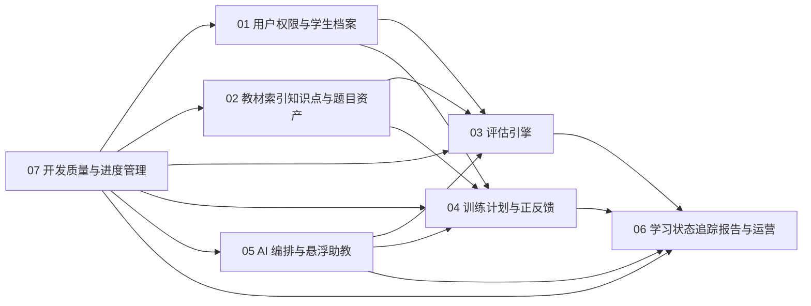

# 小学学习闭环系统模块总览与开发计划

## 1. 文档目标

本文基于现有需求分析与 Web 详细设计，给出一套可直接驱动 AI 分模块开发的实施蓝图。

本文解决四个问题：

1. 系统应该拆成哪些模块
2. 模块之间如何依赖和协作
3. AI 开发应按什么顺序推进
4. 如何通过统一门禁保障开发质量和进度透明

---

## 2. 模块拆分

建议首期拆分为 7 份可独立开发的详细设计文档：

1. [01-用户权限与学生档案模块.md](</f:/workspace/github/StudyAgent/doc/module-design/01-用户权限与学生档案模块.md>)
2. [02-教材索引知识点与题目资产模块.md](</f:/workspace/github/StudyAgent/doc/module-design/02-教材索引知识点与题目资产模块.md>)
3. [03-评估引擎模块.md](</f:/workspace/github/StudyAgent/doc/module-design/03-评估引擎模块.md>)
4. [04-训练计划与正反馈模块.md](</f:/workspace/github/StudyAgent/doc/module-design/04-训练计划与正反馈模块.md>)
5. [05-AI编排与悬浮助教模块.md](</f:/workspace/github/StudyAgent/doc/module-design/05-AI编排与悬浮助教模块.md>)
6. [06-学习状态追踪报告与运营模块.md](</f:/workspace/github/StudyAgent/doc/module-design/06-学习状态追踪报告与运营模块.md>)
7. [07-开发质量与进度管理规范.md](</f:/workspace/github/StudyAgent/doc/module-design/07-开发质量与进度管理规范.md>)

---

## 3. 模块职责总表

| 模块 | 核心职责 | 关键输出 | 主要依赖 |
|---|---|---|---|
| 用户权限与学生档案 | 用户登录、角色绑定、学生档案、学科配置 | 学生主体、家长绑定、角色权限 | 无 |
| 教材索引知识点与题目资产 | 教材导入、章节结构、知识点树、题库资产 | 教材树、知识点树、题目池 | 用户权限 |
| 评估引擎 | 组卷、评估会话、答案判定、评估结论 | 评估结果、错因摘要、评估事件 | 教材资产、AI 编排 |
| 训练计划与正反馈 | 今日任务、训练会话、难度调节、反馈触发 | 任务、训练记录、正反馈事件 | 教材资产、评估引擎、AI 编排 |
| AI 编排与悬浮助教 | AI 请求路由、上下文组装、助教会话、安全约束 | AI 结构化结果、助教回答、AI 洞察 | 全模块 |
| 学习状态追踪报告与运营 | 掌握度投影、风险检测、日报周报、运营看板 | 掌握度快照、报告、分析看板 | 评估、训练、AI |
| 开发质量与进度管理 | 任务拆分、门禁规则、阶段验收、进度透明 | 任务卡、质量门禁、里程碑状态 | 全模块 |

---

## 4. 模块依赖图

---

## 5. 推荐开发顺序

### 5.1 阶段 0：基础骨架

目标：

1. 搭建仓库结构
2. 初始化前后端工程
3. 初始化数据库迁移体系
4. 初始化模块间事件机制

依赖文档：

1. 01
2. 07

### 5.2 阶段 1：内容底座

目标：

1. 跑通用户、家长、学生档案
2. 跑通教材导入和教材树查询
3. 跑通知识点和题目资产录入

依赖文档：

1. 01
2. 02

### 5.3 阶段 2：评估闭环

目标：

1. 上线入门评估
2. 上线评估组卷、答题、结果页
3. 接入 AI 评估分析

依赖文档：

1. 03
2. 05

### 5.4 阶段 3：训练闭环

目标：

1. 上线今日任务
2. 上线知识点训练和错题重练
3. 上线即时反馈与失败恢复

依赖文档：

1. 04
2. 05

### 5.5 阶段 4：状态与报告闭环

目标：

1. 上线掌握度热力图
2. 上线日报和周报
3. 上线家长端风险建议

依赖文档：

1. 06
2. 05

### 5.6 阶段 5：统一联调

目标：

1. 打通学生端与家长端主要链路
2. 联调悬浮助教
3. 跑通质量门禁和里程碑验收

依赖文档：

1. 全部模块

---

## 6. AI 开发任务单元标准

每个 AI 开发任务必须是一个可独立验收的任务卡。

任务卡标准字段：

1. `task_id`
2. `module_name`
3. `goal`
4. `write_scope`
5. `read_scope`
6. `dependencies`
7. `api_contract`
8. `events_contract`
9. `tests_required`
10. `acceptance_criteria`

建议每张任务卡只允许覆盖以下范围之一：

1. 一个控制器与其对应服务
2. 一个核心领域对象及仓储
3. 一个页面与其 API 接口联调
4. 一个异步流程或事件处理器

不建议一张任务卡同时跨多个模块写入。

---

## 7. 模块间接口原则

### 7.1 同步接口

用于：

1. 页面直接查询
2. 提交答题
3. 获取即时反馈

形式：

1. REST API
2. 结构化 JSON DTO

### 7.2 异步接口

用于：

1. 评估完成后更新学习状态
2. 训练完成后生成报告
3. AI 分析完成后写回洞察

形式：

1. 领域事件
2. 任务队列

### 7.3 边界约束

所有模块必须遵守：

1. 不直接读写其他模块内部表
2. 通过公开 API 或事件协作
3. 不在多个模块重复定义同一领域对象的写入逻辑

---

## 8. 统一验收门禁

每个模块上线前必须同时满足：

1. 文档中定义的核心 API 已实现
2. 主要流程图对应链路可跑通
3. 单元测试覆盖核心领域逻辑
4. 至少 1 条集成测试覆盖主流程
5. 关键失败分支已验证
6. 日志、审计、错误码符合统一约定

---

## 9. 进度管理建议

建议用“模块 -> 任务卡 -> 验收状态”三级进度板。

### 9.1 模块状态

1. `not_started`
2. `in_design`
3. `in_dev`
4. `in_test`
5. `ready_for_merge`
6. `completed`

### 9.2 任务卡状态

1. `todo`
2. `doing`
3. `blocked`
4. `code_done`
5. `verified`
6. `closed`

### 9.3 每周例行检查

每周至少检查：

1. 本周关闭的任务卡数量
2. 各模块阻塞点
3. 接口变更风险
4. AI 输出质量问题
5. 联调失败原因

---

## 10. 首期里程碑

### 里程碑 M1：可建档可导入内容

完成标准：

1. 学生和家长关系可建立
2. 语文、数学、英语教材索引可查询
3. 知识点与题库资产可录入

### 里程碑 M2：可评估

完成标准：

1. 可发起入门评估
2. 可完成答题和结果页
3. AI 可生成错因分析

### 里程碑 M3：可训练

完成标准：

1. 可生成今日任务
2. 可完成知识点训练
3. 可触发即时反馈与失败恢复

### 里程碑 M4：可陪伴

完成标准：

1. 学生端悬浮助教可解释题目和任务
2. 家长端助教可解读周报和给建议

### 里程碑 M5：可跟踪

完成标准：

1. 系统可生成掌握度热力图
2. 可生成日报和周报
3. 运营后台可查看基础指标

---

## 11. 结论

这套模块拆分的核心目标，不是把文档拆多，而是把职责、接口、开发范围和验收标准拆清楚。

只要后续开发严格以模块文档为边界、以任务卡为最小交付单元、以门禁规则做验收，AI 开发就能在不相互踩踏的前提下稳定推进。
