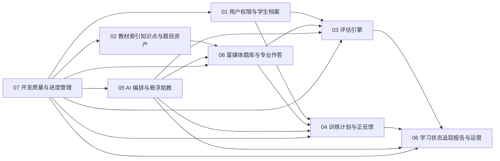

# 小学学习闭环系统模块总览与开发计划

## 1. 文档目标

本文基于当前需求分析与 Web 详细设计，给出一套可直接驱动 AI 分模块开发的实施蓝图。

本文重点回答五个问题：

1. 系统应拆成哪些模块。
2. 模块之间如何协作。
3. 富媒体题库与专业作答能力落在哪个模块。
4. 开发顺序如何调整。
5. 如何保证后续进度与质量可控。

---

## 2. 模块拆分

建议首期拆分为 8 份可独立开发的详细设计文档：

1. [01-用户权限与学生档案模块.md](</f:/workspace/github/StudyAgent/doc/module-design/01-用户权限与学生档案模块.md>)
2. [02-教材索引知识点与题目资产模块.md](</f:/workspace/github/StudyAgent/doc/module-design/02-教材索引知识点与题目资产模块.md>)
3. [03-评估引擎模块.md](</f:/workspace/github/StudyAgent/doc/module-design/03-评估引擎模块.md>)
4. [04-训练计划与正反馈模块.md](</f:/workspace/github/StudyAgent/doc/module-design/04-训练计划与正反馈模块.md>)
5. [05-AI编排与悬浮助教模块.md](</f:/workspace/github/StudyAgent/doc/module-design/05-AI编排与悬浮助教模块.md>)
6. [06-学习状态追踪报告与运营模块.md](</f:/workspace/github/StudyAgent/doc/module-design/06-学习状态追踪报告与运营模块.md>)
7. [07-开发质量与进度管理规范.md](</f:/workspace/github/StudyAgent/doc/module-design/07-开发质量与进度管理规范.md>)
8. [08-富媒体题库与专业作答模块.md](</f:/workspace/github/StudyAgent/doc/module-design/08-富媒体题库与专业作答模块.md>)

说明：

1. `02` 继续负责教材索引、章节树、知识点树与基础内容关系。
2. `08` 新增负责题目文档模型、导入、作答模式、题源治理与富媒体渲染。

---

## 3. 模块职责总表

| 模块 | 核心职责 | 关键输出 | 主要依赖 |
|---|---|---|---|
| 用户权限与学生档案 | 用户登录、角色绑定、学生档案、学科配置 | 学生主体、家长绑定、角色权限 | 无 |
| 教材索引知识点与题目资产 | 教材导入、章节结构、知识点树、教材映射 | 教材树、知识点树、教材上下文 | 用户权限 |
| 评估引擎 | 组卷、评估会话、答题、判题、评估结论 | 评估结果、错因摘要、评估事件 | 02、05、08 |
| 训练计划与正反馈 | 今日任务、训练会话、提示恢复、反馈触发 | 任务、训练记录、反馈事件 | 02、03、05、08 |
| AI 编排与悬浮助教 | AI 请求路由、上下文组装、助教会话、安全约束 | AI 结构化结果、助教回答、AI 洞察 | 全模块 |
| 学习状态追踪报告与运营 | 掌握度快照、风险检测、日报周报、运营看板 | 报告、画像、分析看板 | 03、04、05 |
| 开发质量与进度管理 | 任务拆分、质量门禁、阶段验收、进度透明 | 任务卡、门禁、里程碑状态 | 全模块 |
| 富媒体题库与专业作答 | 题目文档、作答模型、导入任务、题源治理、渲染快照 | 题目资产、作答协议、导入结果 | 02、05 |

---

## 4. 模块依赖图

---

## 5. 推荐开发顺序

### 5.1 阶段 0：基础骨架

目标：

1. 搭建 Monorepo 基础结构。
2. 初始化前后端工程。
3. 初始化数据库迁移体系。
4. 初始化统一 contracts、错误码、审计和请求追踪。

依赖文档：

1. 01
2. 07

### 5.2 阶段 1：账户与内容底座

目标：

1. 跑通家长、学生档案与绑定。
2. 跑通教材导入和教材树查询。
3. 跑通知识点树维护。

依赖文档：

1. 01
2. 02

### 5.3 阶段 2：富媒体题库底座

目标：

1. 建立题目文档模型和作答模型。
2. 建立数学公式输入与渲染。
3. 建立题目编辑、预览、审核和发布能力。
4. 建立本地教材导入任务骨架。
5. 建立题源与许可治理。

依赖文档：

1. 02
2. 05
3. 08

### 5.4 阶段 3：评估闭环

目标：

1. 上线入门评估。
2. 上线评估组卷、答题和结果页。
3. 接入多题型答题。
4. 接入 AI 评估分析。

依赖文档：

1. 03
2. 05
3. 08

### 5.5 阶段 4：训练闭环

目标：

1. 上线今日任务。
2. 上线知识点训练和错题重练。
3. 上线多题型训练工作区。
4. 上线即时反馈和失败恢复。

依赖文档：

1. 04
2. 05
3. 08

### 5.6 阶段 5：状态与报告闭环

目标：

1. 上线掌握度热力图。
2. 上线日报和周报。
3. 上线家长端风险建议。

依赖文档：

1. 06
2. 05

### 5.7 阶段 6：统一联调

目标：

1. 打通家长建档到学生训练的完整链路。
2. 联调悬浮助教。
3. 联调导入、审核、发布、评估、训练和报告。
4. 跑通质量门禁和里程碑验收。

依赖文档：

1. 全模块

---

## 6. AI 开发任务单元标准

每个 AI 开发任务必须是一个可独立验收的任务卡。

任务卡标准字段：

1. `task_id`
2. `module_name`
3. `goal`
4. `write_scope`
5. `read_scope`
6. `dependencies`
7. `api_contract`
8. `events_contract`
9. `tests_required`
10. `acceptance_criteria`

建议每张任务卡只允许覆盖以下范围之一：

1. 一个控制器与其对应服务。
2. 一个核心领域对象及仓储。
3. 一个页面与其 API 联调。
4. 一个异步流程或事件处理器。
5. 一个题型渲染器与其答案协议。

---

## 7. 模块间接口原则

### 7.1 同步接口

用于：

1. 页面查询
2. 答题提交
3. 题目渲染与预览
4. 获取即时反馈

形式：

1. REST API
2. 结构化 JSON DTO

### 7.2 异步接口

用于：

1. 导入任务推进
2. 评估完成后更新学习状态
3. 训练完成后生成报告
4. AI 分析完成后写回洞察

形式：

1. 领域事件
2. 任务队列

### 7.3 边界约束

所有模块必须遵守：

1. 不直接读写其他模块内部表。
2. 通过公开 API 或事件协作。
3. 不在多个模块重复定义同一领域对象的写入逻辑。
4. 题目渲染和作答协议统一由 `08` 模块输出。

---

## 8. 统一验收门禁

每个模块上线前必须同时满足：

1. 文档中定义的核心 API 已实现。
2. 主要流程图对应链路可跑通。
3. 单元测试覆盖核心领域逻辑。
4. 至少 1 条集成测试覆盖主流程。
5. 关键失败分支已验证。
6. 日志、审计、错误码符合统一约定。

针对 `08` 模块额外要求：

1. 题目渲染在桌面端和移动端可用。
2. 公式题、图文题和子题组题至少各有 1 条端到端用例。
3. 导入任务具备审核、回滚和溯源能力。

---

## 9. 进度管理建议

建议用“模块 -> 任务卡 -> 验收状态”三级进度板。

### 9.1 模块状态

1. `not_started`
2. `in_design`
3. `in_dev`
4. `in_test`
5. `ready_for_merge`
6. `completed`

### 9.2 任务卡状态

1. `todo`
2. `doing`
3. `blocked`
4. `code_done`
5. `verified`
6. `closed`

### 9.3 每周例行检查

每周至少检查：

1. 当前阶段是否有跨模块阻塞。
2. 题目文档与作答协议是否发生破坏性变化。
3. 导入任务和题源治理是否存在合规风险。
4. 评估、训练、助教是否仍消费同一套题目契约。

---

## 10. 当前建议的下一轮开发起点

结合新增模块与当前目标，下一轮开发建议从以下顺序开始：

1. `08` 模块的题目文档模型、数据库结构和 contracts。
2. 数学公式输入与渲染。
3. 本地教材导入任务骨架。
4. 评估与训练对新题目协议的接入改造。
