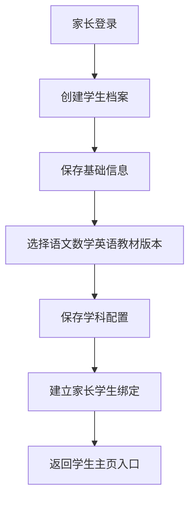
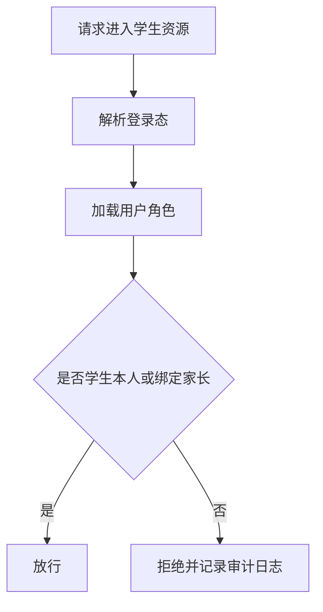

# 用户权限与学生档案模块详细设计

## 1. 模块目标

本模块负责提供系统最基础的主体能力：

1. 用户身份登录
2. 角色权限控制
3. 家长与学生绑定
4. 学生档案与学科配置

它是所有学习行为的入口模块。

---

## 2. 逻辑边界

### 2.1 本模块负责

1. 用户账号
2. 登录态
3. 家长、学生、教师、运营角色
4. 学生基础档案
5. 学生学科启用状态
6. 家长与学生关系绑定

### 2.2 本模块不负责

1. 教材结构和题库
2. 评估规则
3. 训练任务生成
4. AI 分析
5. 报告生成

---

## 3. 领域对象设计

## 3.1 核心实体

1. `UserAccount`
2. `AuthSession`
3. `StudentProfile`
4. `ParentStudentBinding`
5. `SubjectEnrollment`
6. `AccessPolicy`

## 3.2 类设计

```ts
class UserAccount {
  id: string;
  role: 'parent' | 'student' | 'teacher' | 'operator' | 'admin';
  displayName: string;
  phone?: string;
  email?: string;
  status: 'active' | 'disabled';
}

class StudentProfile {
  id: string;
  userId: string;
  nickname: string;
  grade: number;
  defaultVersionMap: Record<'chinese' | 'math' | 'english', string>;
  learningPreferences: LearningPreferences;
}

class ParentStudentBinding {
  id: string;
  parentUserId: string;
  studentId: string;
  relation: 'father' | 'mother' | 'guardian';
  status: 'active' | 'inactive';
}

class SubjectEnrollment {
  id: string;
  studentId: string;
  subject: 'chinese' | 'math' | 'english';
  enabled: boolean;
  textbookVersionId: string;
}
```

## 3.3 服务类设计

```ts
interface AuthService {
  login(command: LoginCommand): Promise<AuthSession>;
  logout(sessionId: string): Promise<void>;
  validate(token: string): Promise<UserAccount>;
}

interface StudentProfileService {
  createProfile(command: CreateStudentProfileCommand): Promise<StudentProfile>;
  updateProfile(command: UpdateStudentProfileCommand): Promise<StudentProfile>;
  enrollSubject(command: EnrollSubjectCommand): Promise<SubjectEnrollment>;
  getProfile(studentId: string): Promise<StudentProfileView>;
}

interface ParentBindingService {
  bindStudent(command: BindStudentCommand): Promise<ParentStudentBinding>;
  listChildren(parentUserId: string): Promise<StudentProfileView[]>;
}

interface AccessPolicyService {
  canAccessStudent(user: UserAccount, studentId: string): Promise<boolean>;
}
```

---

## 4. 模块结构建议

### 4.1 后端目录建议

```text
src/modules/account/
  controllers/
  application/
  domain/
  infrastructure/
  dto/
```

### 4.2 前端目录建议

```text
src/app/(parent)/
src/app/(student)/
src/features/account/
src/features/student-profile/
```

---

## 5. 核心流程

## 5.1 家长创建学生档案流程



## 5.2 权限校验流程



---

## 6. 接口定义

## 6.1 REST API

### 6.1.1 认证接口

1. `POST /api/auth/login`
2. `POST /api/auth/logout`
3. `GET /api/auth/me`

请求 DTO：

```ts
type LoginRequest = {
  provider: 'passwordless' | 'password';
  principal: string;
  credential: string;
};
```

### 6.1.2 学生档案接口

1. `POST /api/students`
2. `PATCH /api/students/:studentId`
3. `GET /api/students/:studentId/profile`
4. `POST /api/students/:studentId/subjects`

请求 DTO：

```ts
type CreateStudentProfileRequest = {
  nickname: string;
  grade: number;
  preferredSessionMinutes: number;
  defaultVersionMap: {
    chinese: string;
    math: string;
    english: string;
  };
};
```

### 6.1.3 家长绑定接口

1. `POST /api/parents/:parentUserId/bindings`
2. `GET /api/parents/:parentUserId/students`

---

## 7. 数据表建议

1. `user_accounts`
2. `auth_sessions`
3. `student_profiles`
4. `parent_student_bindings`
5. `subject_enrollments`
6. `audit_logs`

---

## 8. 事件定义

本模块发布：

1. `student.created`
2. `student.updated`
3. `student.subject_enrolled`
4. `parent.student_bound`

本模块消费：

1. 无强依赖事件

---

## 9. AI 开发任务切片建议

### 9.1 第一批任务卡

1. 登录与会话管理
2. 学生档案创建接口
3. 家长与学生绑定接口
4. 权限守卫中间件

### 9.2 单卡示例

任务：实现 `StudentProfileService.createProfile`

写入范围：

1. `student_profiles`
2. `subject_enrollments`
3. `parent_student_bindings`

验收标准：

1. 可创建学生档案
2. 可写入三科配置
3. 可生成绑定关系
4. 失败时事务回滚

---

## 10. 测试要点

1. 家长不能访问未绑定学生
2. 学生年级与教材版本不能为空
3. 重复绑定应幂等或返回明确错误
4. 禁用账号不能继续访问
5. 审计日志必须记录关键访问失败

---

## 11. 模块完成定义

满足以下条件视为模块完成：

1. 家长可登录并创建学生档案
2. 三科配置可保存
3. 家长与学生绑定关系可查询
4. 权限拦截生效
5. 所有 API 有集成测试覆盖
