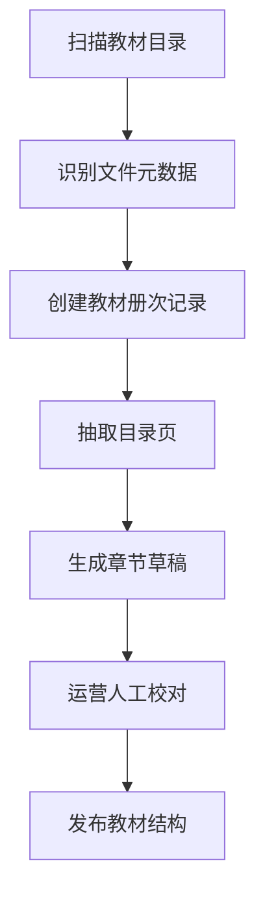
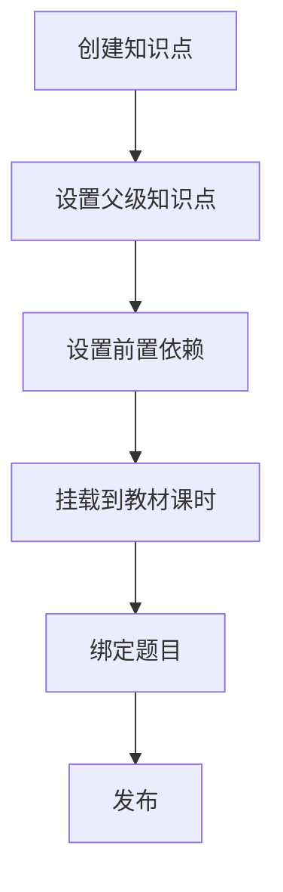

# 教材索引知识点与题目资产模块详细设计

## 1. 模块目标

本模块负责建立系统的内容主数据底座，确保所有评估、训练、AI 分析和题库建设都基于统一教材索引和知识点资产运行。

核心目标：

1. 导入语文、数学、英语教材索引。
2. 维护教材章节树。
3. 维护知识点树和前置关系。
4. 维护教材、知识点与题目之间的映射关系主数据。

说明：

1. 富媒体题目文档、作答模式、导入任务和题源治理由 `08` 模块负责。
2. 本模块保留题目与教材、知识点的关系主数据能力。

---

## 2. 逻辑边界

### 2.1 本模块负责

1. 教材目录扫描。
2. 教材文件元数据入库。
3. 单元、课时结构维护。
4. 知识点树维护。
5. 知识点前置依赖维护。
6. 教材、知识点与题目关系维护。

### 2.2 本模块不负责

1. 富媒体题目内容编辑。
2. 题目作答模式定义。
3. 题目导入任务执行。
4. 个性化评估结果。
5. 训练任务会话。
6. AI 助教对话。

---

## 3. 领域对象设计

## 3.1 核心实体

1. `TextbookVolume`
2. `TextbookUnit`
3. `TextbookLesson`
4. `KnowledgePoint`
5. `KnowledgeDependency`
6. `LessonKnowledgeMapping`
7. `QuestionKnowledgeMapping`
8. `QuestionLessonMapping`
9. `ContentReviewTask`

## 3.2 类设计

```ts
class TextbookVolume {
  id: string;
  subject: 'chinese' | 'math' | 'english';
  publisherVersion: string;
  grade: number;
  term: 'first' | 'second';
  sourcePath: string;
  status: 'draft' | 'published';
}

class KnowledgePoint {
  id: string;
  subject: 'chinese' | 'math' | 'english';
  name: string;
  parentId?: string;
  gradeBand: string;
  difficultyLevel: number;
  status: 'draft' | 'published';
}

class QuestionKnowledgeMapping {
  questionId: string;
  knowledgePointId: string;
  relationType: 'primary' | 'secondary' | 'prerequisite';
}
```

## 3.3 服务类设计

```ts
interface TextbookImportService {
  importFromDirectory(command: ImportTextbookDirectoryCommand): Promise<ImportJobResult>;
  publishVolume(volumeId: string): Promise<void>;
}

interface TextbookTreeService {
  getVolumeTree(volumeId: string): Promise<TextbookTreeView>;
  upsertLesson(command: UpsertLessonCommand): Promise<TextbookLesson>;
}

interface KnowledgePointService {
  create(command: CreateKnowledgePointCommand): Promise<KnowledgePoint>;
  linkDependency(command: LinkKnowledgeDependencyCommand): Promise<void>;
  mapToLesson(command: MapKnowledgePointToLessonCommand): Promise<void>;
}

interface ContentRelationService {
  mapQuestionToKnowledge(command: MapQuestionKnowledgeCommand): Promise<void>;
  mapQuestionToLesson(command: MapQuestionLessonCommand): Promise<void>;
}
```

---

## 4. 模块结构建议

```text
src/modules/content/
  textbook/
  knowledge/
  relations/
  review/
```

---

## 5. 核心流程

## 5.1 教材导入流程



## 5.2 知识点挂载流程



---

## 6. 接口定义

## 6.1 REST API

### 6.1.1 教材导入与查询

1. `POST /api/admin/textbooks/import`
2. `GET /api/textbooks`
3. `GET /api/textbooks/:volumeId/tree`
4. `PATCH /api/admin/textbooks/:volumeId/publish`

导入请求 DTO：

```ts
type ImportTextbookDirectoryRequest = {
  subject: 'chinese' | 'math' | 'english';
  basePath: string;
  publisherVersion: string;
};
```

### 6.1.2 知识点接口

1. `POST /api/admin/knowledge-points`
2. `PATCH /api/admin/knowledge-points/:id`
3. `POST /api/admin/knowledge-points/:id/dependencies`
4. `POST /api/admin/knowledge-points/:id/lessons`
5. `GET /api/knowledge-points/:id`

### 6.1.3 题目关系接口

1. `POST /api/admin/questions/:id/knowledge-points`
2. `POST /api/admin/questions/:id/lessons`
3. `GET /api/questions/:id/mappings`

---

## 7. 事件定义

本模块发布：

1. `textbook.volume_published`
2. `knowledge_point.published`
3. `question.knowledge_mapped`
4. `question.lesson_mapped`

本模块消费：

1. `student.subject_enrolled`
2. `question.published`

---

## 8. 数据表建议

1. `textbook_volumes`
2. `textbook_units`
3. `textbook_lessons`
4. `knowledge_points`
5. `knowledge_dependencies`
6. `lesson_knowledge_mappings`
7. `question_knowledge_mappings`
8. `question_lesson_mappings`
9. `content_review_tasks`

---

## 9. 逻辑规则

1. 课时发布前必须归属单元。
2. 同一知识点可绑定多题，但绑定时必须标记主次关系。
3. 知识点依赖关系不能形成环。
4. 任何教材结构自动抽取结果在发布前都必须人工确认。
5. 题目和知识点的映射变化要保留审计记录。

---

## 10. AI 开发任务切片建议

### 10.1 第一批任务卡

1. 教材目录扫描器
2. 教材树查询接口
3. 知识点 CRUD
4. 题目与知识点绑定接口
5. 题目与课时绑定接口

### 10.2 第二批任务卡

1. AI 目录抽取适配器
2. 知识点候选生成器
3. 内容审核工作台

---

## 11. 测试要点

1. 同一教材文件重复导入必须幂等。
2. 教材树查询必须按单元和课时稳定排序。
3. 知识点依赖不能形成环。
4. 已发布题目的知识点映射变更必须有审计记录。
5. 删除知识点前必须校验是否仍有已发布题目绑定。

---

## 12. 模块完成定义

满足以下条件视为模块完成：

1. 三科教材册次可导入。
2. 教材树可查询。
3. 知识点树可维护。
4. 题目与知识点、课时的关系可维护。
5. `08` 模块可通过稳定接口消费教材与知识点主数据。
