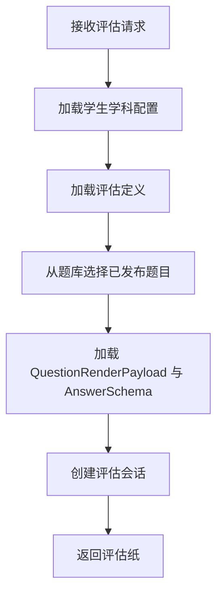
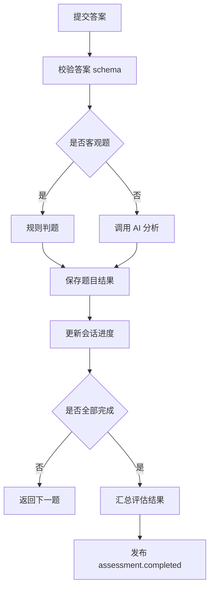

# 评估引擎模块详细设计

## 1. 模块目标

本模块负责将教材、知识点与题库资产编排成正式评估流程，并输出可用于后续学习计划和训练编排的结构化结论。

核心目标：

1. 支持入门诊断、单元评估、阶段评估、微评估和错题回测。
2. 支持多题型统一答题与判定。
3. 支持客观题规则判定与主观题、过程题 AI 分析。
4. 生成知识点层级的评估结果。
5. 发布评估完成事件供后续模块消费。

---

## 2. 逻辑边界

### 2.1 本模块负责

1. 评估定义和组卷。
2. 评估会话创建。
3. 答题记录。
4. 判题与结论汇总。
5. 评估结果页数据。

### 2.2 本模块不负责

1. 教材和知识点主数据维护。
2. 富媒体题目编辑和导入。
3. 今日任务生成。
4. 长周期掌握度投影。
5. 家长周报。

---

## 3. 领域对象设计

## 3.1 核心实体

1. `AssessmentDefinition`
2. `AssessmentSession`
3. `AssessmentItem`
4. `AssessmentAnswerRecord`
5. `AssessmentResult`
6. `AssessmentInsight`

## 3.2 类设计

```ts
class AssessmentSession {
  id: string;
  studentId: string;
  assessmentType: 'initial' | 'unit' | 'stage' | 'micro' | 'retry';
  subject: 'chinese' | 'math' | 'english';
  status: 'pending' | 'in_progress' | 'completed' | 'aborted';
  startedAt: Date;
  completedAt?: Date;
}

class AssessmentItem {
  id: string;
  sessionId: string;
  questionId: string;
  answerMode: string;
  orderIndex: number;
}

class AssessmentResult {
  sessionId: string;
  overallScore: number;
  itemCount: number;
  knowledgeResults: KnowledgeAssessmentResult[];
  errorTypeSummary: ErrorTypeSummary[];
  recommendedActions: string[];
}
```

## 3.3 服务类设计

```ts
interface AssessmentAssembler {
  build(command: BuildAssessmentCommand): Promise<AssessmentPaper>;
}

interface AssessmentSessionService {
  start(command: StartAssessmentCommand): Promise<AssessmentSession>;
  submitAnswer(command: SubmitAssessmentAnswerCommand): Promise<AssessmentProgressView>;
  complete(sessionId: string): Promise<AssessmentResult>;
}

interface ObjectiveGrader {
  grade(question: QuestionRuntimeAsset, answer: StudentAnswerPayload): GradeResult;
}

interface SubjectiveAssessmentAnalyzer {
  analyze(command: AnalyzeSubjectiveAnswerCommand): Promise<AIGradeResult>;
}

interface AssessmentResultComposer {
  compose(sessionId: string): Promise<AssessmentResult>;
}
```

---

## 4. 模块结构建议

```text
src/modules/assessment/
  controllers/
  application/
  domain/
  graders/
  analyzers/
  dto/
```

---

## 5. 核心流程

## 5.1 发起评估流程



## 5.2 答题与判定流程



---

## 6. 接口定义

## 6.1 REST API

1. `POST /api/assessments/start`
2. `POST /api/assessments/:sessionId/answers`
3. `GET /api/assessments/:sessionId/progress`
4. `POST /api/assessments/:sessionId/complete`
5. `GET /api/assessments/:sessionId/result`

开始评估请求 DTO：

```ts
type StartAssessmentRequest = {
  studentId: string;
  subject: 'chinese' | 'math' | 'english';
  assessmentType: 'initial' | 'unit' | 'stage' | 'micro' | 'retry';
  scopeRef?: {
    type: 'unit' | 'knowledge_point' | 'wrong_question_set';
    id: string;
  };
};
```

提交答案请求 DTO：

```ts
type SubmitAssessmentAnswerRequest = {
  itemId: string;
  answer: StudentAnswerPayload;
  elapsedMs: number;
  clientMeta?: {
    hintUsed?: boolean;
    savedDraftCount?: number;
  };
};
```

---

## 7. 内部接口与依赖

本模块依赖：

1. `QuestionRuntimePort`
2. `AIAnalysisPort`
3. `EventBus`

接口建议：

```ts
interface QuestionRuntimePort {
  pickAssessmentQuestions(query: AssessmentQuestionQuery): Promise<QuestionRuntimeAsset[]>;
  getQuestionRuntime(questionId: string): Promise<QuestionRuntimeAsset>;
}

interface AIAnalysisPort {
  analyzeAssessmentAnswer(command: AnalyzeSubjectiveAnswerCommand): Promise<AIGradeResult>;
}
```

说明：

1. `QuestionRuntimeAsset` 由 `08` 模块提供，内含题目渲染数据、作答模式和判题配置。
2. 评估引擎不直接依赖题目编辑表结构。

---

## 8. 事件定义

本模块发布：

1. `assessment.started`
2. `assessment.answer_submitted`
3. `assessment.completed`

`assessment.completed` 负载建议：

```ts
type AssessmentCompletedEvent = {
  sessionId: string;
  studentId: string;
  subject: 'chinese' | 'math' | 'english';
  knowledgeResults: Array<{
    knowledgePointId: string;
    score: number;
    errorTypes: string[];
  }>;
  recommendedActions: string[];
};
```

---

## 9. 逻辑规则

1. 评估会话完成后不可再次提交答案。
2. 同一题目只能保留一份最终判定结果。
3. 评估只允许使用已发布、许可合法的题目。
4. AI 判定结果必须保存原始摘要和结构化结论。
5. 微评估题量必须受时长限制。
6. 错题回测优先使用原题或同知识点同难度变体。
7. AI 分析失败时必须返回明确错误并进入异常处理，不输出假结果。

---

## 10. AI 开发任务切片建议

### 10.1 第一批任务卡

1. 评估会话创建接口
2. QuestionRuntimePort 接入
3. 客观题判题器
4. 提交答案接口
5. 结果汇总器

### 10.2 第二批任务卡

1. 主观题与过程题 AI 分析适配器
2. 错因分类器
3. 推荐动作生成器

---

## 11. 测试要点

1. 评估组卷必须只使用已发布题目。
2. 客观题结果必须可重复计算。
3. 公式题、图文题和子题组题都能正常提交答案。
4. 主观题 AI 分析失败时必须返回可识别错误。
5. 中途退出评估会话必须有明确状态。
6. 结果页必须能定位到知识点层级。

---

## 12. 模块完成定义

满足以下条件视为模块完成：

1. 五类评估会话均可创建。
2. 多题型答题和判定主链路可跑通。
3. 客观题与主观题都可得出结果或明确错误。
4. 评估完成事件可被其他模块消费。
5. 结果页数据结构稳定且可联调。
