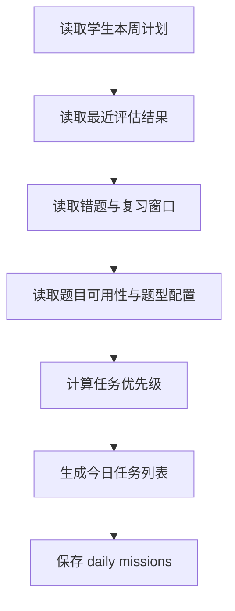
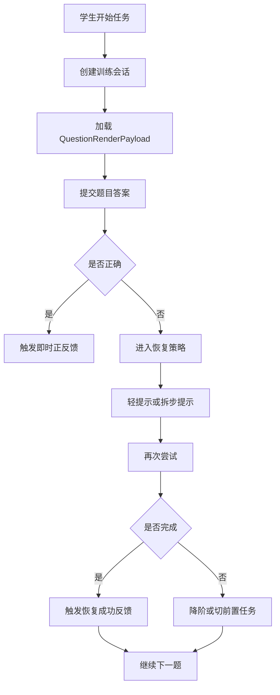

# 训练计划与正反馈模块详细设计

## 1. 模块目标

本模块负责把评估结论和内容资产编排成学生每天可执行的训练任务，并在训练过程中提供即时反馈、失败恢复和任务完成后的正向激励。

核心目标：

1. 生成今日任务与本周计划。
2. 执行知识点训练、错题重练和间隔复习。
3. 适配多题型、多作答模式训练工作区。
4. 提供难度调节与失败恢复。
5. 触发即时反馈与阶段反馈。

---

## 2. 逻辑边界

### 2.1 本模块负责

1. 任务编排。
2. 训练会话。
3. 提示与恢复策略。
4. 正反馈触发规则。
5. 训练完成后的任务级总结。

### 2.2 本模块不负责

1. 题目文档编辑和导入。
2. 学生身份和权限。
3. 周报生成。
4. AI 模型选择和路由。

---

## 3. 领域对象设计

## 3.1 核心实体

1. `StudyPlan`
2. `DailyMission`
3. `MissionItem`
4. `PracticeSession`
5. `PracticeItemRecord`
6. `FeedbackEvent`
7. `ReviewSchedule`

## 3.2 类设计

```ts
class StudyPlan {
  id: string;
  studentId: string;
  subject: 'chinese' | 'math' | 'english';
  weekStartDate: string;
  goals: string[];
  requiredKnowledgePointIds: string[];
  status: 'draft' | 'active' | 'completed';
}

class DailyMission {
  id: string;
  studentId: string;
  subject: 'chinese' | 'math' | 'english';
  missionType: 'new_learning' | 'practice' | 'retry' | 'review';
  targetKnowledgePointIds: string[];
  estimatedMinutes: number;
  status: 'pending' | 'in_progress' | 'completed' | 'skipped';
}

class PracticeItemRecord {
  id: string;
  sessionId: string;
  questionId: string;
  answerMode: string;
  attempts: number;
  status: 'pending' | 'correct' | 'wrong' | 'skipped';
}
```

## 3.3 服务类设计

```ts
interface StudyPlanService {
  generateWeeklyPlan(command: GenerateWeeklyPlanCommand): Promise<StudyPlan>;
  getWeeklyPlan(studentId: string, subject: string): Promise<StudyPlanView>;
}

interface MissionPlanner {
  buildTodayMissions(command: BuildTodayMissionsCommand): Promise<DailyMission[]>;
}

interface PracticeSessionService {
  startMission(missionId: string): Promise<PracticeSession>;
  submitAnswer(command: SubmitPracticeAnswerCommand): Promise<PracticeProgressView>;
  requestHint(command: RequestHintCommand): Promise<HintView>;
  completeMission(missionId: string): Promise<MissionCompletionView>;
}

interface FeedbackRuleEngine {
  evaluate(command: EvaluateFeedbackTriggerCommand): Promise<FeedbackEvent[]>;
}

interface RecoveryPolicyService {
  decideNextStep(command: DecideRecoveryStepCommand): Promise<RecoveryDecision>;
}
```

---

## 4. 模块结构建议

```text
src/modules/training/
  plan/
  mission/
  practice/
  feedback/
  recovery/
```

---

## 5. 核心流程

## 5.1 生成今日任务流程



## 5.2 训练执行流程



---

## 6. 接口定义

## 6.1 REST API

1. `GET /api/plans/weekly`
2. `POST /api/plans/weekly/generate`
3. `GET /api/missions/today`
4. `POST /api/missions/:missionId/start`
5. `POST /api/missions/:missionId/answers`
6. `POST /api/missions/:missionId/hints`
7. `POST /api/missions/:missionId/complete`
8. `GET /api/missions/:missionId/result`

生成周计划请求 DTO：

```ts
type GenerateWeeklyPlanRequest = {
  studentId: string;
  subject: 'chinese' | 'math' | 'english';
  weekStartDate: string;
  availableMinutesPerDay: number;
};
```

答题请求 DTO：

```ts
type SubmitPracticeAnswerRequest = {
  itemId: string;
  answer: StudentAnswerPayload;
  elapsedMs: number;
  usedHintLevel?: 0 | 1 | 2 | 3;
};
```

---

## 7. 内部接口与依赖

本模块依赖：

1. `AssessmentQueryPort`
2. `QuestionRuntimePort`
3. `AIHintPort`
4. `EventBus`

```ts
interface AssessmentQueryPort {
  getLatestAssessmentSummary(studentId: string, subject: string): Promise<AssessmentSummary>;
}

interface QuestionRuntimePort {
  getQuestionRuntime(questionId: string): Promise<QuestionRuntimeAsset>;
}

interface AIHintPort {
  explainQuestion(command: ExplainQuestionCommand): Promise<HintPayload>;
  generateRecoveryFeedback(command: GenerateRecoveryFeedbackCommand): Promise<string>;
}
```

---

## 8. 任务优先级逻辑

建议优先级得分：

`priority = weak_knowledge * 0.35 + retry_due * 0.25 + review_due * 0.2 + textbook_progress * 0.15 + parent_focus * 0.05`

规则：

1. 同一天总任务时长不得超过年级配置上限。
2. 错题重练优先级高于普通巩固。
3. 新知任务必须受当前教材进度约束。
4. 恢复中的知识点短期内必须重复出现。
5. 任务生成时要兼顾题型复杂度，避免同一任务里连续堆叠高操作负担题。

---

## 9. 事件定义

本模块发布：

1. `weekly_plan.generated`
2. `mission.generated`
3. `practice.answer_submitted`
4. `mission.completed`
5. `feedback.triggered`

本模块消费：

1. `assessment.completed`
2. `student.subject_enrolled`

---

## 10. 前端组件设计

建议前端组件：

```ts
type StudentHomePage;
type TodayMissionCard;
type MissionProgressBar;
type PracticeWorkspace;
type HintPanel;
type FeedbackToast;
type MissionSummaryCard;
type QuestionRenderer;
type FormulaField;
type TableAnswerGrid;
type MultiPartQuestionPanel;
```

组件职责：

1. `TodayMissionCard` 展示任务目标和预计时长。
2. `PracticeWorkspace` 承载答题、提示和恢复链路。
3. `QuestionRenderer` 承载题目内容块渲染。
4. `FeedbackToast` 承载即时反馈。
5. `MissionSummaryCard` 展示任务完成后的复盘。

---

## 11. AI 开发任务切片建议

### 11.1 第一批任务卡

1. 今日任务生成接口
2. 训练会话创建与答题接口
3. QuestionRuntimePort 接入
4. 提示请求接口
5. 正反馈触发器

### 11.2 第二批任务卡

1. 周计划生成器
2. 失败恢复策略服务
3. 错题重练调度器
4. 间隔复习调度器
5. 多题型训练工作区联调

---

## 12. 测试要点

1. 今日任务不能包含未发布题目。
2. 同一任务完成后不可重复提交。
3. 提示次数必须进入记录。
4. 连续错误后必须触发恢复策略。
5. 公式题、图文题和子题组题都能正常训练。
6. 反馈触发器必须可重复验证。
7. AI 提示失败时必须给出明确错误，不输出伪提示。

---

## 13. 模块完成定义

满足以下条件视为模块完成：

1. 可生成今日任务与本周计划。
2. 可完成多题型训练主链路。
3. 可提供提示、恢复和反馈。
4. 可发布训练事件给状态追踪模块。
5. 学生端页面可完整联调。
