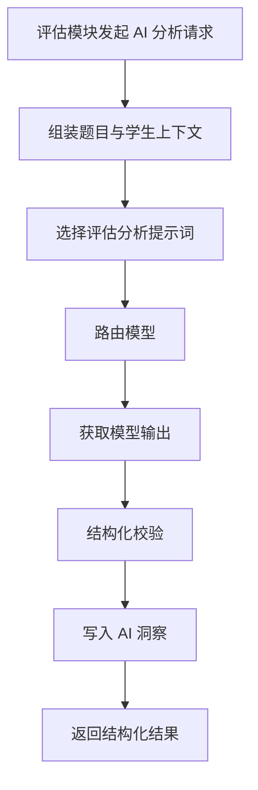
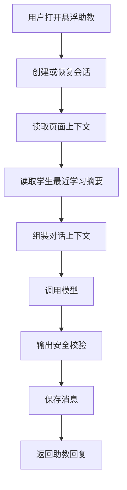
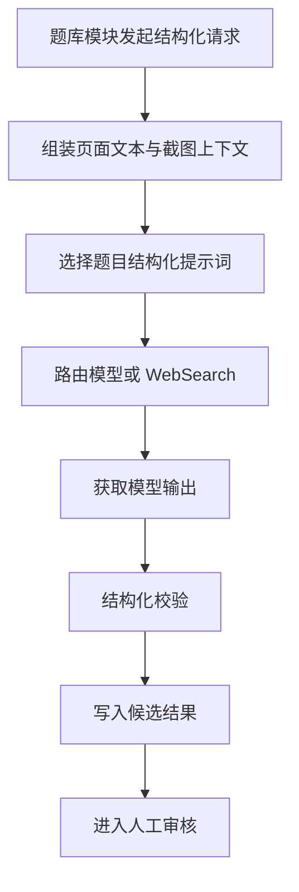

# AI 编排与悬浮助教模块详细设计

## 1. 模块目标

本模块是系统的 AI 中台和统一助教入口，负责管理模型调用、提示词、上下文组装、安全约束和悬浮助教对话。

核心目标：

1. 提供统一 AI 请求入口
2. 为评估、训练、报告和题目导入等模块输出结构化 AI 结果
3. 为学生和家长提供上下文感知的悬浮助教
4. 对 AI 输出做约束、审计和错误处理

---

## 2. 逻辑边界

### 2.1 本模块负责

1. AI 请求封装
2. 模型路由
3. 提示词模板管理
4. 上下文装配
5. 输出校验
6. 助教对话会话
7. 题目结构化与题源辅助分析

### 2.2 本模块不负责

1. 学生掌握度最终计算
2. 教材和题目资产维护
3. 页面主业务流程控制

---

## 3. 领域对象设计

## 3.1 核心实体

1. `PromptTemplate`
2. `AIRequestEnvelope`
3. `AIResponseEnvelope`
4. `AIInsightRecord`
5. `AssistantSession`
6. `AssistantMessage`
7. `SafetyReviewRecord`

## 3.2 类设计

```ts
class AIRequestEnvelope {
  id: string;
  scenario: 'assessment' | 'hint' | 'report' | 'assistant_chat' | 'content_structuring' | 'source_research';
  userRole: 'student' | 'parent' | 'operator';
  context: Record<string, unknown>;
  responseSchema: string;
}

class AssistantSession {
  id: string;
  studentId?: string;
  userRole: 'student' | 'parent';
  pageContext: string;
  contextRefType?: string;
  contextRefId?: string;
  status: 'active' | 'closed';
}
```

## 3.3 服务类设计

```ts
interface AIOrchestrator {
  execute(command: AIExecutionCommand): Promise<AIResponseEnvelope>;
}

interface ContextAssembler {
  assemble(command: AssembleContextCommand): Promise<Record<string, unknown>>;
}

interface ModelRouter {
  select(command: SelectModelCommand): Promise<ModelSelection>;
}

interface OutputGuardService {
  validate(command: ValidateAIOutputCommand): Promise<ValidatedAIOutput>;
}

interface AssistantSessionService {
  open(command: OpenAssistantSessionCommand): Promise<AssistantSession>;
  chat(command: AssistantChatCommand): Promise<AssistantReply>;
  close(sessionId: string): Promise<void>;
}
```

---

## 4. 模块结构建议

```text
src/modules/ai/
  orchestrator/
  prompts/
  context/
  safety/
  assistant/
  adapters/
```

---

## 5. 核心流程

## 5.1 评估分析 AI 流程



## 5.2 悬浮助教对话流程



## 5.3 题目结构化 AI 流程



---

## 6. 接口定义

## 6.1 REST API

1. `POST /api/ai/assistant/sessions`
2. `POST /api/ai/assistant/sessions/:sessionId/messages`
3. `GET /api/ai/assistant/sessions/:sessionId/messages`
4. `POST /api/ai/assessment/analyze`
5. `POST /api/ai/hints/generate`
6. `POST /api/ai/reports/explain`
7. `GET /api/admin/ai/prompts`
8. `PATCH /api/admin/ai/prompts/:promptId`

对话请求 DTO：

```ts
type AssistantChatRequest = {
  message: string;
  pageContext: 'student_home' | 'assessment' | 'mission' | 'review' | 'weekly_report';
  contextRef?: {
    type: 'mission' | 'assessment' | 'report';
    id: string;
  };
};
```

AI 分析响应 DTO：

```ts
type AIAnalysisResponse = {
  summary: string;
  structuredResult: Record<string, unknown>;
  confidenceLevel: 'low' | 'medium' | 'high';
  reviewRequired: boolean;
};
```

---

## 7. 内部接口与依赖

本模块依赖只读接口：

1. `StudentContextQueryPort`
2. `MissionContextQueryPort`
3. `AssessmentContextQueryPort`
4. `ReportContextQueryPort`

```ts
interface StudentContextQueryPort {
  getStudentSummary(studentId: string): Promise<StudentSummaryContext>;
}

interface MissionContextQueryPort {
  getMissionContext(missionId: string): Promise<MissionAIContext>;
}
```

---

## 8. 输出约束设计

### 8.1 学生端约束

1. 默认不给完整答案
2. 优先给轻提示
3. 文案必须简短、友好、具体

### 8.2 家长端约束

1. 不输出惩罚式教育建议
2. 不把单次错误上升为能力定性
3. 给建议时必须包含“现在可以怎么做”

### 8.3 结构化输出要求

所有业务型 AI 输出至少要有：

1. `summary`
2. `actionable_points`
3. `risk_flags`
4. `confidence_level`
5. `error_code`

补充约束：

1. 不得臆造题目来源、许可信息或教材定位信息。
2. 无法确认时必须输出错误或 `review_required` 标记。

---

## 9. 前端组件设计

```ts
type AssistantDock
type AssistantBubble
type AssistantPanel
type AssistantMessageList
type AssistantInputBox
type AssistantContextBanner
```

组件职责：

1. `AssistantDock` 负责收起和展开状态
2. `AssistantContextBanner` 展示当前关联任务或报告
3. `AssistantPanel` 承载消息列表和输入框

---

## 10. 事件定义

本模块发布：

1. `ai.insight_created`
2. `assistant.session_opened`
3. `assistant.message_answered`
4. `ai.output_blocked`

本模块消费：

1. `assessment.completed`
2. `mission.completed`
3. `report.generated`

---

## 11. AI 开发任务切片建议

### 11.1 第一批任务卡

1. AI 编排入口服务
2. PromptTemplate 读取与版本管理
3. 助教会话 API
4. 输出校验器

### 11.2 第二批任务卡

1. 评估分析场景适配器
2. 训练提示场景适配器
3. 报告解释场景适配器
4. 题目结构化场景适配器
5. 助教前端浮层组件

---

## 12. 测试要点

1. 相同场景输入必须返回符合 schema 的结构
2. 输出违反边界规则时必须被拦截
3. 助教上下文切换时不能串会话
4. 模型不可用时必须返回明确错误
5. 所有 AI 输出必须落审计记录

---

## 13. 模块完成定义

满足以下条件视为模块完成：

1. 业务模块可通过统一 AI 接口调用
2. 悬浮助教可在学生端和家长端使用
3. AI 输出可被结构化解析
4. 有安全校验和明确错误策略
5. 关键会话与洞察有完整记录
