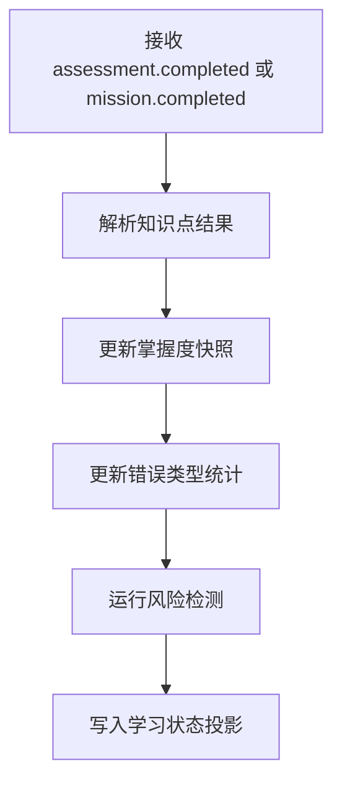
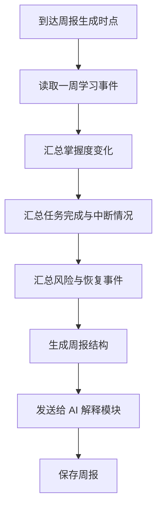

# 学习状态追踪报告与运营模块详细设计

## 1. 模块目标

本模块负责将评估、训练、AI 洞察等事件沉淀为稳定的学习状态，并输出学生成长视图、家长报告和运营看板。

核心目标：

1. 构建学生掌握度状态
2. 识别风险信号
3. 生成日报、周报和热力图
4. 为运营后台提供可查询指标

---

## 2. 逻辑边界

### 2.1 本模块负责

1. 事件采集
2. 学习状态投影
3. 掌握度快照
4. 风险检测
5. 报告生成
6. 运营分析查询

### 2.2 本模块不负责

1. 评估会话本身
2. 训练流程本身
3. AI 模型调用
4. 教材和题库维护

---

## 3. 领域对象设计

## 3.1 核心实体

1. `StudentMasterySnapshot`
2. `KnowledgeProgressProjection`
3. `RiskSignal`
4. `DailyReport`
5. `WeeklyReport`
6. `AnalyticsMetric`

## 3.2 类设计

```ts
class StudentMasterySnapshot {
  id: string;
  studentId: string;
  subject: 'chinese' | 'math' | 'english';
  knowledgePointId: string;
  masteryScore: number;
  confidenceScore: number;
  status: 'unknown' | 'learning' | 'unstable' | 'mastered' | 'at_risk';
  updatedAt: Date;
}

class RiskSignal {
  id: string;
  studentId: string;
  subject: 'chinese' | 'math' | 'english';
  type: 'streak_break' | 'retry_failure' | 'mastery_drop' | 'high_hint_dependency';
  level: 'low' | 'medium' | 'high';
  summary: string;
}
```

## 3.3 服务类设计

```ts
interface LearningStateProjector {
  apply(event: DomainEvent): Promise<void>;
}

interface MasteryCalculator {
  recalculate(command: RecalculateMasteryCommand): Promise<StudentMasterySnapshot>;
}

interface RiskDetector {
  detect(studentId: string, subject: string): Promise<RiskSignal[]>;
}

interface ReportBuilder {
  buildDaily(studentId: string, date: string): Promise<DailyReport>;
  buildWeekly(studentId: string, weekStartDate: string): Promise<WeeklyReport>;
}

interface AnalyticsQueryService {
  getOperationalOverview(query: AnalyticsQuery): Promise<AnalyticsDashboardView>;
}
```

---

## 4. 模块结构建议

```text
src/modules/progress/
  projectors/
  mastery/
  risks/
  reports/
  analytics/
```

---

## 5. 核心流程

## 5.1 学习状态更新流程



## 5.2 周报生成流程



---

## 6. 接口定义

## 6.1 REST API

1. `GET /api/progress/mastery-heatmap`
2. `GET /api/reports/daily`
3. `GET /api/reports/weekly`
4. `GET /api/reports/unit`
5. `GET /api/parents/:parentUserId/alerts`
6. `GET /api/admin/analytics/overview`
7. `GET /api/admin/analytics/ai-quality`

周报查询 DTO：

```ts
type WeeklyReportQuery = {
  studentId: string;
  weekStartDate: string;
  subject?: 'chinese' | 'math' | 'english';
};
```

---

## 7. 内部接口与依赖

本模块消费：

1. `assessment.completed`
2. `mission.completed`
3. `feedback.triggered`
4. `ai.insight_created`

本模块依赖：

1. `AIExplainPort` 用于把周报翻译成家长可读文本

```ts
interface AIExplainPort {
  explainWeeklyReport(command: ExplainWeeklyReportCommand): Promise<AIReportExplanation>;
}
```

---

## 8. 状态计算规则

### 8.1 掌握度建议

掌握度更新参考输入：

1. 最近评估分数
2. 最近训练正确率
3. 错题回测结果
4. 提示依赖程度

### 8.2 风险信号建议

以下情况触发风险检测：

1. 连续 3 天未完成任务
2. 同一知识点连续回测失败
3. 提示依赖率持续过高
4. 掌握度明显回落

---

## 9. 前端组件设计

```ts
type MasteryHeatmap
type DailyReportCard
type WeeklyReportPage
type ParentAlertPanel
type AdminAnalyticsDashboard
```

组件职责：

1. `MasteryHeatmap` 展示知识点掌握状态
2. `ParentAlertPanel` 展示需要家长关注的重点
3. `AdminAnalyticsDashboard` 展示内容质量和 AI 命中情况

---

## 10. AI 开发任务切片建议

### 10.1 第一批任务卡

1. 事件投影器
2. 掌握度快照查询接口
3. 日报生成器
4. 周报生成器

### 10.2 第二批任务卡

1. 风险检测器
2. 家长提醒接口
3. 运营概览接口
4. AI 质量分析看板

---

## 11. 测试要点

1. 重复消费事件必须幂等
2. 周报生成必须可重跑
3. 风险规则需可配置且可测试
4. 热力图查询延迟需可控
5. 周报内容与学习事件必须可追溯

---

## 12. 模块完成定义

满足以下条件视为模块完成：

1. 学习状态可随评估和训练事件更新
2. 掌握度热力图可查询
3. 日报和周报可生成
4. 家长风险提醒可读取
5. 运营后台能看到核心指标
