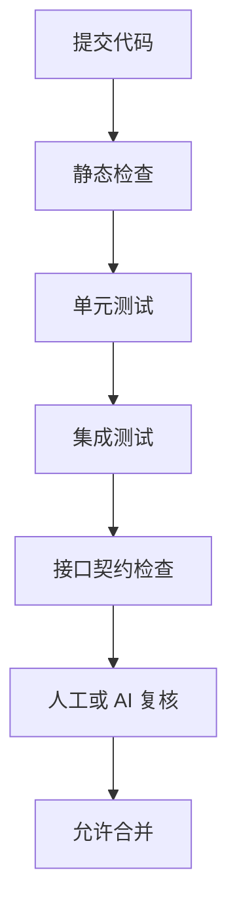

# 开发质量与进度管理规范

## 1. 文档目标

本文用于约束后续人类开发与 AI 开发的协作方式，确保模块级开发既能并行推进，也能稳定集成。

本文重点覆盖：

1. 开发任务拆分规则
2. 代码质量门禁
3. 测试与验收要求
4. 进度管理方式
5. 模块联调规则

---

## 2. AI 开发协作原则

1. 一次只处理一个明确模块或一个明确任务卡
2. 每张任务卡必须有明确写入范围
3. 没有接口契约的功能不得直接开工
4. 任何跨模块改动都必须先更新接口文档
5. 联调前先通过模块自测

---

## 3. 任务拆分规则

### 3.1 Definition of Ready

任务卡在进入开发前，必须具备：

1. 目标说明
2. 写入范围
3. 读取依赖
4. API 或事件契约
5. 测试要求
6. 验收标准

### 3.2 Definition of Done

任务卡在关闭前，必须满足：

1. 代码实现完成
2. 单元测试通过
3. 至少一条主链路集成测试通过
4. 文档同步更新
5. 错误处理完整
6. 日志和审计齐全

---

## 4. 测试策略

### 4.1 单元测试

覆盖重点：

1. 领域对象规则
2. 服务层核心算法
3. 权限校验
4. 难度调节和反馈触发
5. AI 输出校验

### 4.2 集成测试

覆盖重点：

1. API 与数据库交互
2. 事件发布与消费
3. 关键模块之间契约一致性

### 4.3 端到端测试

首期建议至少覆盖：

1. 家长建档 -> 学生入门评估
2. 今日任务 -> 训练完成 -> 反馈触发
3. 事件投影 -> 周报生成 -> 家长端查看
4. 悬浮助教在任务页与周报页的使用

---

## 5. 接口管理规范

### 5.1 API 契约管理

1. 所有 API 先写 DTO 再写实现
2. 响应体字段必须稳定命名
3. 不允许直接返回内部 ORM 模型

### 5.2 事件契约管理

1. 所有事件都必须定义 `event_name`
2. 事件载荷必须有版本字段
3. 消费方必须支持幂等

事件载荷建议格式：

```ts
type DomainEventEnvelope<T> = {
  eventName: string;
  eventVersion: number;
  eventId: string;
  occurredAt: string;
  payload: T;
};
```

---

## 6. 代码结构规范

### 6.1 后端规范

每个模块统一分层：

1. `controllers`
2. `application`
3. `domain`
4. `infrastructure`
5. `dto`

### 6.2 前端规范

每个页面统一分层：

1. 页面容器
2. 业务 hooks
3. 纯展示组件
4. API client

---

## 7. 质量门禁

每次合并前至少满足：

1. Lint 通过
2. Type check 通过
3. 单元测试通过
4. 关键集成测试通过
5. 无新增高危 TODO

建议门禁顺序：



---

## 8. 进度管理方法

### 8.1 任务看板字段

每张任务卡至少记录：

1. `task_id`
2. `module`
3. `title`
4. `status`
5. `owner`
6. `start_date`
7. `target_date`
8. `blockers`
9. `test_evidence`
10. `merge_ref`

### 8.2 模块燃尽

每个模块建议拆成：

1. 接口层任务
2. 领域层任务
3. 数据层任务
4. 页面联调任务
5. 测试与验收任务

### 8.3 周报模板

建议每周输出：

1. 已完成任务卡
2. 当前进行中任务卡
3. 模块阻塞点
4. 质量问题统计
5. 下周目标

---

## 9. 联调规则

1. 联调前必须冻结 API 契约
2. 联调问题优先记录到契约变更清单
3. 不允许在联调阶段临时改动核心数据结构而不更新文档
4. 悬浮助教、评估、训练、报告四条主链路必须分别做冒烟测试

---

## 10. 风险管理

### 10.1 常见风险

1. 多个 AI 任务同时修改同一模块
2. 接口字段不一致
3. AI 输出格式漂移
4. 事件重复消费导致状态污染

### 10.2 控制措施

1. 每张任务卡限制写入范围
2. 使用 DTO 和事件版本控制
3. 对 AI 输出增加 schema 校验
4. 对投影与事件消费实现幂等

---

## 11. 模块验收节奏

建议节奏：

1. 模块设计冻结
2. 任务卡拆分完成
3. 开发完成
4. 模块自测完成
5. 模块联调完成
6. 里程碑验收完成

---

## 12. 结论

进度管理和质量管理不是开发结束后的附属工作，而是 AI 分模块开发能否稳定推进的前置条件。

只要把任务卡、接口契约、测试门禁和联调规则固定下来，后续即使多轮 AI 开发并行进行，也能保持节奏和质量。
