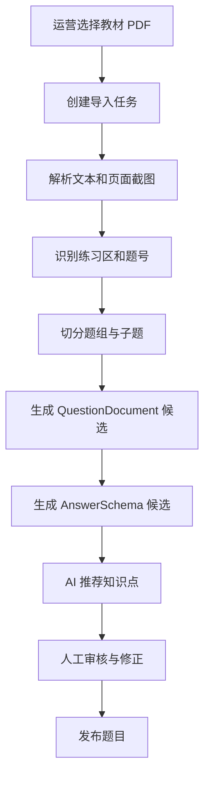
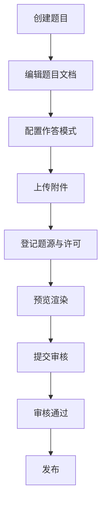
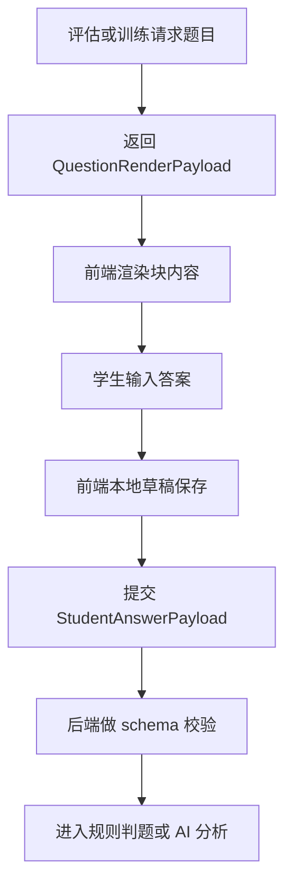

# 富媒体题库与专业作答模块详细设计

## 1. 模块目标

本模块负责把系统中的题目能力从“字符串题目 + 单一输入框”升级为“结构化题目文档 + 多作答模式 + 可导入可审核可追溯的题库体系”。

核心目标：

1. 建立统一题目文档模型。
2. 支持公式、图文、子题组、表格、音视频和几何画布等内容块。
3. 支持多种专业作答模式。
4. 支持本地教材题目结构化导入。
5. 支持题源治理、许可管理、审核与发布。
6. 为评估和训练输出统一渲染与作答协议。

---

## 2. 逻辑边界

### 2.1 本模块负责

1. 题目结构化文档定义。
2. 题目作答模式定义。
3. 题目编辑、预览、审核和发布。
4. 题目附件与对象存储管理。
5. 本地教材导入任务。
6. 公开内容适配导入接口。
7. 题源、许可和溯源治理。
8. 题目运行时渲染协议输出。

### 2.2 本模块不负责

1. 学生身份和权限控制。
2. 教材册次和知识点树主数据维护。
3. 评估结论计算。
4. 训练计划生成。
5. AI 模型选择和路由。

### 2.3 与其他模块边界

1. `02` 模块负责教材索引、知识点树和教材映射主数据。
2. `08` 模块负责题目内容、题目导入、题目渲染和题源治理。
3. `03` 与 `04` 模块只消费 `08` 输出的统一题目渲染协议和答案协议。
4. `05` 模块为 `08` 提供 AI 结构化提取、知识点候选和内容解释能力。

---

## 3. 领域对象设计

## 3.1 核心实体

1. `Question`
2. `QuestionDocument`
3. `QuestionBlock`
4. `QuestionAnswerSchema`
5. `QuestionAttachment`
6. `QuestionSourceRecord`
7. `QuestionImportJob`
8. `QuestionImportRecord`
9. `QuestionReviewTask`
10. `QuestionRenderSnapshot`

## 3.2 类设计

```ts
class Question {
  id: string;
  subject: 'chinese' | 'math' | 'english';
  gradeBand: string;
  difficultyLevel: number;
  questionTypeCode: string;
  sourceRecordId: string;
  status: 'draft' | 'reviewing' | 'published' | 'archived';
}

class QuestionDocument {
  questionId: string;
  version: number;
  blocks: QuestionBlock[];
  layoutMode: 'default' | 'reading_split' | 'multi_part' | 'canvas_assist';
  accessibilityConfig: Record<string, unknown>;
}

class QuestionAnswerSchema {
  questionId: string;
  mode:
    | 'single_choice'
    | 'multiple_choice'
    | 'boolean'
    | 'text_blank'
    | 'numeric_blank'
    | 'formula_blank'
    | 'multi_blank'
    | 'table_fill'
    | 'matching'
    | 'sorting'
    | 'drag_drop'
    | 'hotspot'
    | 'geometry_draw'
    | 'stepwise'
    | 'image_upload'
    | 'short_answer'
    | 'audio_record';
  responseShape: Record<string, unknown>;
  validationRules: Record<string, unknown>;
  gradingConfig: Record<string, unknown>;
}

class QuestionSourceRecord {
  id: string;
  sourceType: 'internal_textbook' | 'open_content' | 'public_reference' | 'partner';
  sourceName: string;
  sourcePathOrUrl: string;
  licenseClass: 'A_INTERNAL' | 'B_OPEN' | 'C_PUBLIC_REFERENCE_ONLY' | 'D_COMMERCIAL_PARTNER';
  licenseName?: string;
  importJobId?: string;
}
```

## 3.3 服务类设计

```ts
interface QuestionAuthoringService {
  create(command: CreateQuestionCommand): Promise<Question>;
  updateDocument(command: UpdateQuestionDocumentCommand): Promise<QuestionDocument>;
  updateAnswerSchema(command: UpdateQuestionAnswerSchemaCommand): Promise<QuestionAnswerSchema>;
  publish(questionId: string): Promise<void>;
}

interface QuestionImportService {
  createJob(command: CreateQuestionImportJobCommand): Promise<QuestionImportJob>;
  run(jobId: string): Promise<void>;
  reviewRecord(command: ReviewImportRecordCommand): Promise<void>;
}

interface QuestionRenderService {
  buildRenderPayload(command: BuildQuestionRenderPayloadCommand): Promise<QuestionRenderPayload>;
  buildPreviewPayload(questionId: string): Promise<QuestionRenderPayload>;
}

interface QuestionSourceGovernanceService {
  registerSource(command: RegisterQuestionSourceCommand): Promise<QuestionSourceRecord>;
  verifyPolicy(sourceRecordId: string): Promise<SourcePolicyDecision>;
}

interface AnswerSchemaValidationService {
  validate(command: ValidateStudentAnswerCommand): Promise<ValidationResult>;
}
```

---

## 4. 模块结构建议

```text
src/modules/question-workspace/
  question/
  document/
  answer-schema/
  render/
  source-governance/
  import-jobs/
  review/
  attachments/
```

---

## 5. 核心流程

## 5.1 本地教材导入流程



## 5.2 运营编辑发布流程



## 5.3 学生作答流程



---

## 6. 内容块设计

建议首批支持以下块类型：

1. `text`
2. `math_inline`
3. `math_display`
4. `image`
5. `table`
6. `audio`
7. `video`
8. `reading_material`
9. `sub_question_group`
10. `geometry_canvas`
11. `annotation`
12. `divider`

块设计原则：

1. 每个块必须有唯一 `blockId`。
2. 每个块必须支持独立序列化。
3. 块可带元数据，如尺寸、对齐、替代文本和交互配置。
4. 所有公式块必须保存规范化 LaTeX。

---

## 7. 作答模式设计

### 7.1 首批作答模式

1. 单选
2. 多选
3. 判断
4. 文本填空
5. 数值填空
6. 公式填空
7. 多空联动填空
8. 表格填空
9. 连线
10. 排序
11. 拖拽
12. 图片热点
13. 几何绘制
14. 分步作答
15. 图片上传
16. 简答
17. 录音

### 7.2 统一答案协议

建议定义：

```ts
type StudentAnswerPayload = {
  questionId: string;
  mode: string;
  response: Record<string, unknown>;
  clientMeta?: {
    elapsedMs?: number;
    inputMethod?: string;
    usedToolbar?: string[];
  };
};
```

### 7.3 校验原则

1. 所有答案先经过 schema 校验。
2. 校验失败时返回明确错误码和字段级错误说明。
3. 不能用“猜测补齐”代替校验失败。

---

## 8. 接口定义

## 8.1 REST API

### 8.1.1 运营接口

1. `POST /api/admin/question-import-jobs`
2. `GET /api/admin/question-import-jobs/:jobId`
3. `GET /api/admin/question-import-jobs/:jobId/records`
4. `POST /api/admin/question-import-records/:recordId/review`
5. `POST /api/admin/questions`
6. `PATCH /api/admin/questions/:id`
7. `POST /api/admin/questions/:id/document`
8. `POST /api/admin/questions/:id/answer-schema`
9. `POST /api/admin/questions/:id/source`
10. `POST /api/admin/questions/:id/knowledge-points`
11. `POST /api/admin/questions/:id/preview`
12. `PATCH /api/admin/questions/:id/publish`

### 8.1.2 运行时接口

1. `GET /api/questions/:id/render`
2. `POST /api/questions/:id/answers/validate`
3. `GET /api/questions/:id/attachments/:attachmentId`

### 8.1.3 导入任务请求 DTO

```ts
type CreateQuestionImportJobRequest = {
  importType: 'textbook_pdf' | 'qti' | 'h5p' | 'manual_seed';
  subject: 'chinese' | 'math' | 'english';
  sourcePathOrUrl: string;
  sourcePolicy: {
    sourceType: 'internal_textbook' | 'open_content' | 'public_reference' | 'partner';
    licenseClass: 'A_INTERNAL' | 'B_OPEN' | 'C_PUBLIC_REFERENCE_ONLY' | 'D_COMMERCIAL_PARTNER';
    licenseName?: string;
  };
};
```

---

## 9. 内部接口与依赖

本模块依赖：

1. `TextbookContextQueryPort`
2. `KnowledgePointQueryPort`
3. `AIExtractionPort`
4. `ObjectStoragePort`
5. `AuditLogPort`

```ts
interface TextbookContextQueryPort {
  getVolumeContext(volumeId: string): Promise<TextbookVolumeContext>;
}

interface KnowledgePointQueryPort {
  suggestMappings(command: SuggestQuestionKnowledgeMappingsQuery): Promise<KnowledgePointCandidate[]>;
}

interface AIExtractionPort {
  structureQuestionFromPage(command: StructureQuestionFromPageCommand): Promise<StructuredQuestionCandidate>;
}

interface ObjectStoragePort {
  putObject(command: PutObjectCommand): Promise<StoredObjectRef>;
}
```

---

## 10. 事件定义

本模块发布：

1. `question.import_job_created`
2. `question.import_record_generated`
3. `question.review_submitted`
4. `question.published`
5. `question.archived`
6. `question.source_registered`

本模块消费：

1. `textbook.volume_published`
2. `knowledge_point.published`

---

## 11. 数据表建议

1. `questions`
2. `question_documents`
3. `question_document_versions`
4. `question_blocks`
5. `question_answer_schemas`
6. `question_attachments`
7. `question_sources`
8. `question_import_jobs`
9. `question_import_records`
10. `question_review_tasks`
11. `question_render_snapshots`

---

## 12. 逻辑规则

1. 题目发布前必须存在有效题源记录。
2. 题目发布前必须至少绑定 1 个知识点。
3. `C_PUBLIC_REFERENCE_ONLY` 的来源不得直接发布完整题面。
4. 所有自动导入结果必须经过人工审核。
5. 公式题必须保存规范化公式表达，而不是仅保存渲染结果图片。
6. 图片热点题必须保存统一坐标系。
7. 图片上传题必须定义文件类型、大小和审核策略。
8. 多子题题组既要支持整体发布，也要支持子题级作答与判题。

---

## 13. AI 开发任务切片建议

### 13.1 第一批任务卡

1. 题目文档表结构与 Prisma 模型
2. QuestionDocument contracts 与 Zod schema
3. 数学公式输入组件与后端持久化
4. 题目渲染 payload 组装器
5. 题目后台编辑器基础版
6. 本地教材导入任务骨架

### 13.2 第二批任务卡

1. 图片与表格题块支持
2. 子题组与分步作答支持
3. 题源治理与许可校验
4. 导入审核工作台
5. 评估和训练接入统一答案协议

### 13.3 第三批任务卡

1. QTI 导入适配器
2. H5P 导入适配器
3. 几何画布题支持
4. 录音题与图片题 AI 分析接入

---

## 14. 测试要点

1. 公式块输入与渲染结果一致。
2. 图文混排题在桌面端和移动端均可正常显示。
3. 子题组题能正确保存子题级答案。
4. 表格题答案校验能定位到具体单元格。
5. 图片上传题可完成上传、预览和重新提交。
6. 导入任务失败时能保留失败原因并支持重试。
7. 许可分类不合法的题目不能发布。
8. `GET /api/questions/:id/render` 返回 payload 必须符合 schema。

---

## 15. 模块完成定义

满足以下条件视为模块完成：

1. 数学题可以结构化创建、编辑、预览和发布。
2. 数学公式、图文题、表格题、子题组题至少可跑通 1 条完整链路。
3. 本地教材题目可通过导入任务生成候选并进入审核。
4. 每道题都具备来源、许可和审核信息。
5. 评估和训练可消费统一题目渲染与作答协议。
